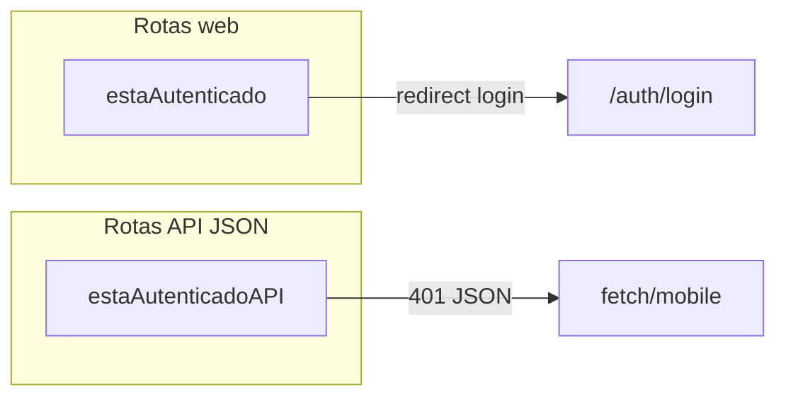

# Plano: pontos de atenção e checklist pré-deploy (AIRPET)

Este plano traduz os itens que listou (sessão/JWT, SQL, pet perdido/chat, social, petshop, frontend, rate limit, logs, Edge) em **verificações concretas** contra o repositório. O detalhamento canônico continua em [contexto_do_projeto.md](c:\Users\u17789\Desktop\vevo\AIRPET\contexto_do_projeto.md) (apêndice “Checklist de risco de regressão por domínio”).

---

## 1. Sessão + JWT (web vs API)

**Regra:** rotas que devolvem HTML usam `estaAutenticado` (redirect); rotas JSON usam `estaAutenticadoAPI` (401) e suportam **Bearer** sem depender só de cookie.

**Onde está:** [src/middlewares/authMiddleware.js](c:\Users\u17789\Desktop\vevo\AIRPET\src\middlewares\authMiddleware.js) — `estaAutenticado` (sessão → JWT cookie → redirect) e `estaAutenticadoAPI` (sessão → `verificarBearerJWT` → JWT cookie → 401).

**Antes de merge/deploy:** para cada rota nova ou alterada, confirmar qual middleware foi aplicado; testar um endpoint API com `Authorization: Bearer` **sem** cookie de sessão e um fluxo web com cookie/sessão.

---

## 2. SQL parametrizado e centralizado em models

**Regra:** placeholders `$1, $2`; SQL em `src/models` (ESLint restringe `query` fora dos models).

**Onde está:** [eslint.config.cjs](c:\Users\u17789\Desktop\vevo\AIRPET\eslint.config.cjs) (`no-restricted-imports` para `database` fora de models).

**Antes de merge:** `npm run lint` (ou o script de lint do projeto); revisar PRs que adicionem `require('../config/database')` fora de `src/models`.

---

## 3. Pet perdido e chat

**Regra pública:** só conteúdo “ativo” com alerta `aprovado` e pet ainda `perdido`; ao resolver, limpar dados sensíveis / encerrar conversas conforme regra de negócio.

**Onde está:** lógica de “ativo” em [src/controllers/petPerdidoController.js](c:\Users\u17789\Desktop\vevo\AIRPET\src\controllers\petPerdidoController.js) (`ativo = alerta.status === 'aprovado' && pet.status === 'perdido'`); listagens públicas em [src/models/PetPerdido.js](c:\Users\u17789\Desktop\vevo\AIRPET\src\models\PetPerdido.js) (`WHERE pp.status = 'aprovado'` onde aplicável).

**Antes de merge:** smoke na página pública de alerta e no mapa/listagens; após mudança de status para resolvido, confirmar que dados sensíveis não vazam na UI.

---

## 4. Social (idempotência + `post_stats`)

**Regra:** idempotência em criação de posts onde existir header; triggers de stats alinhados ao baseline.

**Onde está:** [src/controllers/explorarController.js](c:\Users\u17789\Desktop\vevo\AIRPET\src\controllers\explorarController.js) + [src/models/PostIdempotencyKey.js](c:\Users\u17789\Desktop\vevo\AIRPET\src\models\PostIdempotencyKey.js); triggers documentados em [src/config/migrationBaselineStatements.js](c:\Users\u17789\Desktop\vevo\AIRPET\src\config\migrationBaselineStatements.js) / migrações.

**Antes de merge:** nova migração não deve remover/alterar triggers sem atualizar funções dependentes; retestar curtidas/comentários/reposts em staging.

---

## 5. Petshop (slug único + onboarding transacional)

**Regra:** slug único (loop com `existeSlug`); onboarding em transação.

**Onde está:** [src/services/petshopOnboardingService.js](c:\Users\u17789\Desktop\vevo\AIRPET\src\ervices\petshopOnboardingService.js) (ajustar path se necessário — verificar `src/services/petshopOnboardingService.js`); [src/models/Petshop.js](c:\Users\u17789\Desktop\vevo\AIRPET\src\models\Petshop.js) `existeSlug`; moderação em [src/services/petshopModerationService.js](c:\Users\u17789\Desktop\vevo\AIRPET\src\services\petshopModerationService.js).

**Antes de merge:** painel parceiro continua protegido por `petshopAuthMiddleware` + owner + aprovação nas rotas tocadas (ver [contexto_do_projeto.md](c:\Users\u17789\Desktop\vevo\AIRPET\contexto_do_projeto.md) matriz “Parceiros petshop”).

---

## 6. Frontend: `requestCoordinator` antes do SWR

**Regra:** `swrCache.js` falha se o coordinator não existir (lança erro).

**Onde está:** ordem de scripts em [src/views/partials/header.ejs](c:\Users\u17789\Desktop\vevo\AIRPET\src\views\partials\header.ejs) — `requestCoordinator.js` **antes** de `swrCache.js`; tema dinâmico via `:root` e `ConfigSistema`; manifest em `/manifest.json`.

**Antes de merge:** qualquer novo layout que não use `header.ejs` deve repetir essa ordem; validar PWA (manifest + SW) após novas rotas de assets.

---

## 7. Rate limit (auth, ativação, chat público)

**Onde está:** [src/middlewares/rateLimiter.js](c:\Users\u17789\Desktop\vevo\AIRPET\src\middlewares\rateLimiter.js); uso em [src/routes/authRoutes.js](c:\Users\u17789\Desktop\vevo\AIRPET\src\routes\authRoutes.js), [src/routes/syncApiRoutes.js](c:\Users\u17789\Desktop\vevo\AIRPET\src\routes\syncApiRoutes.js), [src/routes/tagRoutes.js](c:\Users\u17789\Desktop\vevo\AIRPET\src\routes\tagRoutes.js) (`limiterAtivacao`), [src/routes/chatRoutes.js](c:\Users\u17789\Desktop\vevo\AIRPET\src\routes\chatRoutes.js) (`limiterChatPublico`).

**Antes de merge:** rotas novas sensíveis recebem o limiter adequado ou ficam explicitamente atrás do `limiterGeral` em [src/routes/index.js](c:\Users\u17789\Desktop\vevo\AIRPET\src\routes\index.js).

---

## 8. Logs e slow queries

**Onde está:** [src/utils/logger.js](c:\Users\u17789\Desktop\vevo\AIRPET\src\utils\logger.js); pool/query em [src/config/database.js](c:\Users\u17789\Desktop\vevo\AIRPET\src\config\database.js) (slow query conforme implementação atual).

**Antes de merge:** erros em controllers/services continuam usando `logger`; não silenciar exceções críticas.

---

## 9. Edge Worker (`SLOT`, `ORIGIN_BASE_URL`)

**Onde está:** [workers/airpet-edge/src/index.js](c:\Users\u17789\Desktop\vevo\AIRPET\workers\airpet-edge\src\index.js), [workers/airpet-edge/wrangler.toml](c:\Users\u17789\Desktop\vevo\AIRPET\workers\airpet-edge\wrangler.toml).

**Antes de deploy Edge:** validar variáveis no ambiente alvo após qualquer alteração no worker.

---

## Checklist rápido (uma página)

| Área        | Pergunta                                                           |
| ----------- | ------------------------------------------------------------------ |
| Web         | Rotas protegidas ainda usam `estaAutenticado` e redirect funciona? |
| API         | `estaAutenticadoAPI` + Bearer OK?                                  |
| SQL         | Só em models + `$1,$2` + lint passou?                              |
| Pet perdido | Público só `aprovado` + pet `perdido`?                             |
| Social      | Idempotência e stats intactos?                                     |
| Petshop     | Slug único + onboarding transacional + guards painel?              |
| Front       | Coordinator → SWR; tema; PWA?                                      |
| Rate limit  | Auth, ativação, chat público cobertos?                             |
| Ops         | Logs; Edge vars                                                    |

---

## Escopo deste plano

Isto é um **roteiro de verificação e regressão**, não uma lista de tarefas de implementação. Se quiser, no modo agente dá para automatizar parte disso (script que lista rotas sem o middleware esperado, ou testes de contrato API).