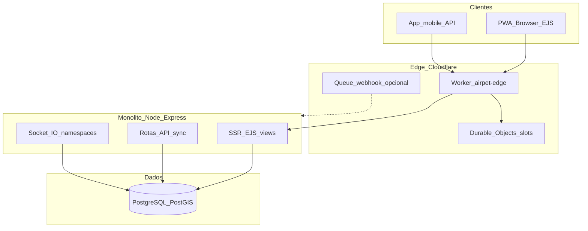
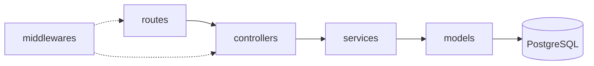
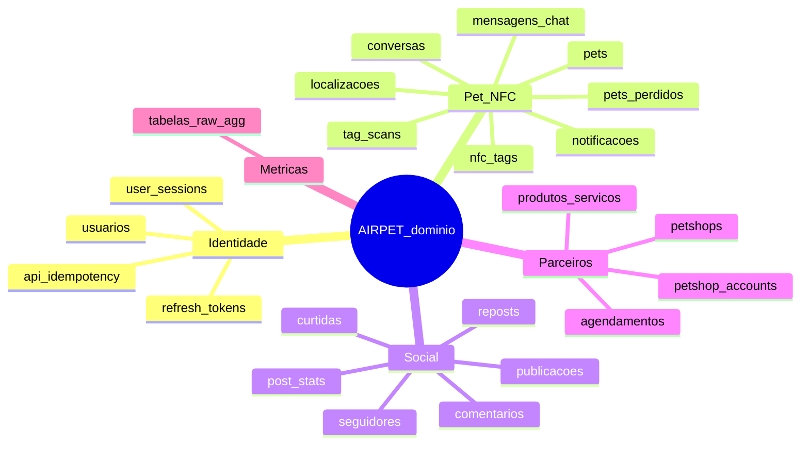
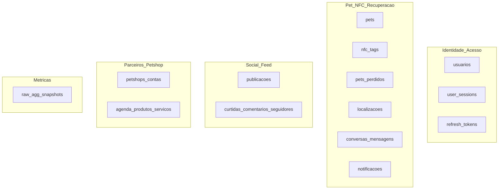
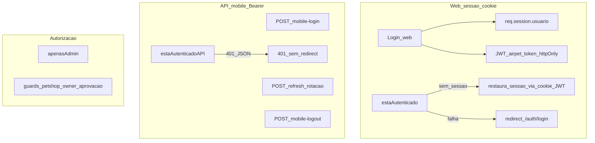
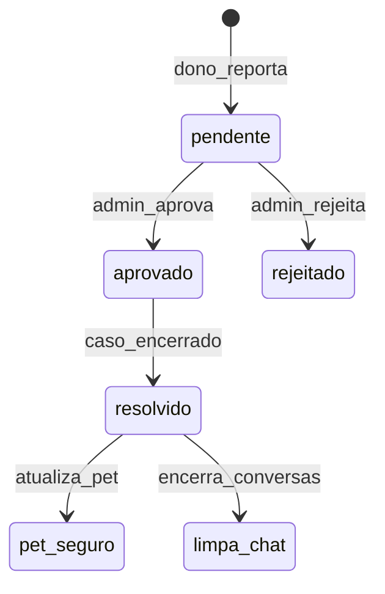
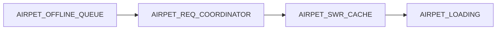
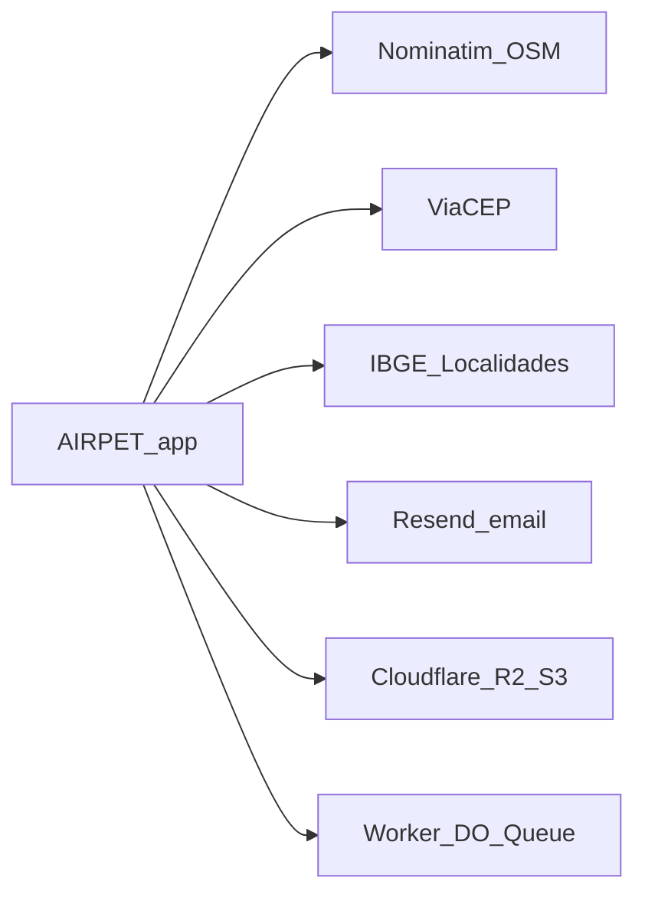

# Diagramas visuais (Mermaid) a partir do contexto AIRPET

Os blocos abaixo podem ser copiados para qualquer renderizador Mermaid (GitHub, Notion, Mermaid Live Editor, extensões VS Code/Cursor).

---

## 1. Arquitetura macro (Seção 1)

---

## 2. Camadas do backend (Seção 3)

---

## 3. Domínios de entidades (Seção 4)

*Nota:* `mindmap` exige sintaxe Mermaid com suporte a mindmap; se o renderizador falhar, use o diagrama 3b abaixo.

### 3b. Domínios (alternativa em flowchart)

---

## 4. Autenticação: Web vs API mobile (Seção 4)

---

## 5. Fluxo resumido: pet perdido (regras centrais)

---

## 6. Estado global no frontend (Seção 6)

---

## 7. Integrações externas (Seção 6)

---

## Onde isso se ancora no repositório

- Arquitetura e pastas: [contexto_do_projeto.md](c:\Users\u17789\Desktop\vevo\AIRPET\contexto_do_projeto.md) §1, §3.
- Rotas/agregador: `src/routes/index.js`, `src/routes/syncApiRoutes.js`.
- Edge: [workers/airpet-edge/src/index.js](c:\Users\u17789\Desktop\vevo\AIRPET\workers\airpet-edge\src\index.js).

---

## Observações de renderização

- Evite espaços nos IDs de nós Mermaid (já aplicado com underscores).
- Se `mindmap` não renderizar, use o fluxo **3b**.
- Para um único “quadro geral”, combine os diagramas 1 + 2 + 4 em documentação separada por seção.

Nenhuma alteração de ficheiros é necessária: estes diagramas são entregáveis de documentação derivados do markdown existente.
