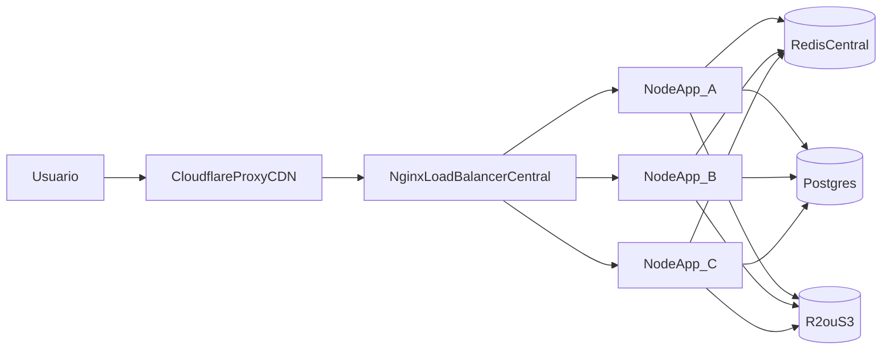

# Plano de Produção Distribuída (AIRPET)

## Decisões já definidas
- Autenticação/sessão: usar Redis no Docker e ajustar estratégia para ambiente distribuído.
- Topologia NGINX: usar um NGINX central (borda) como load balancer principal para distribuir tráfego entre VPSs de aplicação.

## Diagnóstico atual (resumo técnico)
- A aplicação já usa Node/Express/EJS/Tailwind e inicia por [server.js](server.js).
- Sessão atual está em Postgres via [src/config/session.js](src/config/session.js); para seu objetivo, vamos migrar para Redis.
- Há estado em memória/local que prejudica horizontal scale (cache/rate-limit/tokens em memória e storage local).
- Ainda não existem artefatos de containerização (Dockerfile/compose/NGINX) no repositório.

## Arquitetura alvo

## Princípios operacionais obrigatórios
- Redis será configurado como serviço externo por contrato de configuração, mesmo rodando localmente no início.
- No `.env` inicial: `REDIS_HOST=redis` e `REDIS_PORT=6379` (nome do container Docker).
- Quando escalar, mover Redis para VPS dedicada trocando apenas env (`REDIS_HOST=<ip_redis_externo>`), sem alterar código.
- Redis não deve ser exposto publicamente na internet.

## Execução por etapas (com validação)

### Etapa 1 — Inventário e hardening de configuração
- Consolidar variáveis obrigatórias e opcionais em `.env.example`.
- Remover defaults perigosos para produção (`localhost`, `127.0.0.1`) nos pontos críticos.
- Arquivos-alvo: [server.js](server.js), [src/app.js](src/app.js), [src/controllers/authController.js](src/controllers/authController.js), [src/services/emailService.js](src/services/emailService.js), [src/middlewares/validator.js](src/middlewares/validator.js).
- Validação: app sobe com env explícito e sem dependência de host local hardcoded.

### Etapa 2 — Dockerização do app + Redis
- Criar `Dockerfile` otimizado (produção), `.dockerignore` e `docker-compose.yml` com serviços `app` e `redis`.
- Configurar healthcheck e rede interna por nome de serviço (sem localhost interno).
- Preparar compose para evolução: Redis local agora, mas com env pronto para apontar Redis externo depois.
- Arquivos-alvo: `Dockerfile`, `.dockerignore`, `docker-compose.yml`.
- Validação: `docker compose up -d` e checagem de saúde dos containers.

### Etapa 3 — Migrar sessão/estado para Redis
- Alterar [src/config/session.js](src/config/session.js) para store Redis (em vez de Postgres) usando env (`REDIS_HOST`, `REDIS_PORT`, `REDIS_PASSWORD`, etc.).
- Migrar/ajustar estados in-memory críticos (rate-limit e tokens transitórios) para backend compartilhado.
- Revisar expiração/coerência de JWT e cookies.
- Validação: login/logout e persistência de sessão entre reinícios/instâncias.

### Etapa 4 — Preparar horizontal scale em múltiplas VPS
- Garantir zero dependência de filesystem local para dados persistentes (usar storage externo).
- Definir modo de produção para `STORAGE_DRIVER` externo e documentar fallback apenas para dev.
- Validar que duas instâncias da app funcionam com mesmo comportamento.
- Arquivos-alvo: [src/services/storageService.js](src/services/storageService.js), [server.js](server.js), [src/routes/index.js](src/routes/index.js).

### Etapa 5 — NGINX central (Load Balancer principal)
- Criar configuração NGINX central com `upstream` apontando para múltiplas VPS de app.
- Configurar `proxy_pass`, headers corretos (`X-Forwarded-*`, WebSocket upgrade), `real_ip` e timeouts.
- Incluir estratégia de health check/passive failover e política de balanceamento.
- Incluir proteção de upstream com `max_fails=3 fail_timeout=30s` por servidor de app.
- Exemplo alvo:
  - `upstream app_servers {`
  - `  server VPS1:3000 max_fails=3 fail_timeout=30s;`
  - `  server VPS2:3000 max_fails=3 fail_timeout=30s;`
  - `}`
- Arquivos-alvo: `deploy/nginx/airpet-lb.conf` (novo), opcional `deploy/nginx/snippets/*`.
- Validação: tráfego HTTP/WS distribuído entre VPSs sem quebrar sessão/autenticação.

### Etapa 6 — Compatibilidade Cloudflare
- Ajustar `TRUST_PROXY`, cookies `secure`, política de host/proto e checklist DNS/proxy.
- Documentar modo recomendado (Full/Strict), origin cert e headers esperados entre Cloudflare -> NGINX central -> Apps.
- Validação: acesso via domínio Cloudflare funcionando com HTTPS e IP real encaminhado.

### Etapa 7 — Segurança de rede e hardening operacional
- Definir baseline de firewall nas VPS:
  - liberar somente `22/tcp` (SSH), `80/tcp` (HTTP) e `443/tcp` (HTTPS);
  - bloquear acesso público à porta do Redis (`6379`) e demais portas internas.
- Garantir Redis acessível apenas por rede privada/VPN/ACL entre serviços autorizados.
- Validar regras com testes de conectividade interna e externa.

### Etapa 8 — Logs e observabilidade
- Padronizar logs estruturados em `stdout/stderr` para app e NGINX.
- Preparar centralização de logs (ex.: Loki/ELK/Datadog/Cloud logging) com correlação por request-id.
- Definir checklist mínimo de monitoramento (latência, erro 5xx, disponibilidade upstream, conexões Redis).

### Etapa 9 — Testes integrados locais e checklist de produção
- Rodar stack local (app+redis), validar endpoints críticos e fluxos de autenticação/upload.
- Criar checklist de verificação por etapa (pré e pós deploy).

### Etapa 10 — Documentação final obrigatória
- Criar [DEPLOY_VPS.md](DEPLOY_VPS.md) didático (iniciante), cobrindo:
  - Preparar VPS (SSH, update, Docker, Compose)
  - Subir projeto
  - Escalar para múltiplas VPS
  - Configurar NGINX
  - Integrar Cloudflare
  - Testes finais
  - Troubleshooting comum

## Observações de risco tratadas no plano
- Estado local em memória/processo será removido ou tornado não-crítico.
- Persistência local de arquivos em VPS será evitada para produção distribuída.
- Configuração ficará replicável por `.env` e artefatos versionados.

## Critério de aceite
- Stack sobe via Docker em qualquer VPS com mesmo comportamento.
- Sessão/autenticação funciona em múltiplas instâncias.
- NGINX encaminha tráfego corretamente e suporta escala horizontal.
- Upstream do NGINX remove nós com falha via `max_fails`/`fail_timeout`.
- Redis não está publicamente exposto e pode ser migrado para VPS externa apenas mudando `.env`.
- Logs estão preparados para centralização sem refatoração de aplicação.
- Guia [DEPLOY_VPS.md](DEPLOY_VPS.md) permite deploy por usuário iniciante.