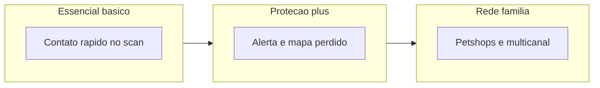

# Estratégia de planos TAG NFC (AIRPET)

## Contexto do produto (código)

No repositório, o catálogo está em [`src/config/planos.js`](src/config/planos.js) e na tabela `plan_definitions` (ex.: [`src/models/tagCommerceSchema.js`](src/models/tagCommerceSchema.js)). Preços atuais: **R$ 19,90 / R$ 29,90 / R$ 39,90** a cada 30 dias, mais hardware da tag no checkout ([`src/views/tags/loja-tag.ejs`](src/views/tags/loja-tag.ejs)).

**Mapeamento sugerido** para os nomes que você usou na conversa:

| Sua nomenclatura | Slug no sistema | Preço mensal |
|------------------|-----------------|--------------|
| Normal / entrada | `basico` | R$ 19,90 |
| Intermediário | `plus` | R$ 29,90 |
| Premium | `familia` | R$ 39,90 |

---

## 1) Análise dos planos atuais — pontos fracos

### Marketing e UX

- **Benefícios técnicos em vez de resultados**: em [`src/views/tags/planos.ejs`](src/views/tags/planos.ejs), os itens vêm de chaves como `scan_publico_basico`, `scan_rico`, `pet_perdido_mapa` — o visitante não entende o **ganho emocional** (“meu pet volta mais rápido”), só rótulos internos.
- **“Plus” e “Familia” são genéricos** no mercado pet/SaaS; não comunicam **para quem** é cada nível nem o **momento de vida** (um pet vs vários, tranquilidade máxima, etc.).
- Na loja ([`src/views/tags/loja-tag.ejs`](src/views/tags/loja-tag.ejs)), só aparecem até **4** chaves brutas por card — reforça a sensação de lista técnica e inconsistente.
- Mensagem **“Recursos premium por plano”** sem prova social, comparação clara ou plano destacado reduz conversão.

### Produto e percepção de valor (crítico)

- As flags em `features_json` **parecem existir só no catálogo**. A experiência pública de scan trata assinatura como **binária** (“plano ativo” vs inativo) em [`src/services/nfcService.js`](src/services/nfcService.js) / [`src/views/nfc/intermediaria.ejs`](src/views/nfc/intermediaria.ejs): quem paga **Plus** ou **Familia** pode **não ver diferença real** em relação ao **Basico** na tela que importa (quem acha o pet). Isso **confirma** a sensação de que “não vale a pena subir de plano”.
- Copy mista: “premium” aparece para qualquer plano pago em [`src/services/tagEntitlementService.js`](src/services/tagEntitlementService.js) (`requirePlanoAtivo`), o que **nivela** Basico e Familia na cabeça do usuário.

### Precificação

- De R$ 19,90 para R$ 39,90 o **salto absoluto é pequeno** em reais; sem diferenciação forte, o usuário tende a **ficar no mais barato** ou a achar que “é tudo a mesma coisa um pouco mais cara”.

---

## 2) Reestruturação dos planos — lógica de progressão

Objetivo: cada degrau deve responder a uma **pergunta de compra** clara.

| Nível | Pergunta que resolve | Promessa (uma frase) |
|-------|----------------------|----------------------|
| **Entrada** | “Quero a tag e o básico para alguém me ligar se achar meu pet.” | Identidade na coleira + contato rápido quando alguém escanear. |
| **Intermediário (âncora)** | “E se ele se perder? Quero visibilidade e rastreio.” | Modo **pet perdido** forte: mapa, alertas, visibilidade na rede. |
| **Premium** | “Quero a rede inteira trabalhando por mim (petshops + canais).” | **Rede de apoio** + notificações em mais canais + diferenciais de tranquilidade. |

**Sugestão de novos nomes comerciais** (mantendo slugs `basico` / `plus` / `familia` para não quebrar backend):

- **Basico** → **AIRPET Essencial** (ou “Tag Essencial”) — foco: *presença digital mínima confiável*.
- **Plus** → **AIRPET Proteção** (badge **“Mais escolhido”**) — foco: *quando o pior acontece*.
- **Familia** → **AIRPET Rede** ou **AIRPET Família+** — foco: *múltiplos pets / rede e canais*.

---

## 3) Benefícios por plano (lista para site)

Textos voltados a **resultado**; alinhar cada item a **feature real no app** (ver seção 6).

**AIRPET Essencial** (`basico`)

- Tag com perfil público: foto, nome e contato para quem encontrar o pet.
- Botões de ação na página do scan (ligar, enviar localização, “encontrei”).
- Explorar e busca na comunidade AIRPET (como hoje).
- Renovação soma +30 dias ao saldo; sem fidelidade (já comunicado na página de planos).

**AIRPET Proteção** (`plus`) — **recomendado**

- Tudo do Essencial.
- **Alerta de pet perdido no mapa** com visibilidade ampliada na rede (benefício central do upgrade).
- **Histórico e contexto de scans** (se o produto expuser ao tutor) para saber *onde* houve interesse.
- Prioridade na experiência quando o pet está marcado como perdido (copy emocional: “cada minuto conta”).

**AIRPET Rede / Família+** (`familia`)

- Tudo do Proteção.
- **Indicação de petshop parceiro** próximo ao scan ou ao alerta (já existe ganchos em [`src/services/nfcService.js`](src/services/nfcService.js) + CTA em [`src/views/nfc/intermediaria.ejs`](src/views/nfc/intermediaria.ejs)).
- **Notificações em mais canais** (push/e-mail/SMS conforme implementado) para o tutor não perder o aviso.
- Posicionar como “para quem tem **mais de um pet** ou quer **máxima rede de ajuda**” (reforça upgrade psicológico).

---

## 4) Estratégias de valor e gatilhos (éticos e sustentáveis)

- **Âncora e destaque**: card do meio com borda, selo **“Mais escolhido”**, e preço mostrando **custo por dia** (ex.: “~R$ 1,00/dia”) — reduz atrito sem mentir.
- **Prova e clareza**: uma linha “O que muda na página quando alguém escaneia sua tag” com **comparativo visual** (Essencial vs Proteção vs Rede) — combate a dúvida principal.
- **Urgência real**: campanhas com prazo (cupom `AIRPET10` já existe no fluxo) em vez de contagem falsa; **grace de 72h** ([`src/services/tagEntitlementService.js`](src/services/tagEntitlementService.js)) pode ser comunicada como “tempo para regularizar sem perder o pet na tela”.
- **Exclusividade verdadeira**: petshops parceiros e canais extras só no topo — só funciona se o produto **bloquear** quem não tem direito (seção 6).
- **Retenção**: lembrete antes do fim do período; narrativa de “saldo soma +30 dias” (já está na copy da loja) como **continuidade sem perder o histórico**.

---

## 5) Marketing — textos prontos (PT-BR)

### Headline da página de planos

**“Escolha quanta proteção o seu pet merece — a tag é só o começo.”**

### Subtítulo

**“Planos mensais mantêm a página da tag ativa e liberam recursos para o momento em que alguém escanear ou quando ele se perder.”**

### Microcopy dos selos (substituir genéricos)

- Em vez de “Recursos premium por plano”: **“Cada plano desbloqueia mais formas de trazer seu pet de volta.”**
- **“Sem fidelidade — cancele quando quiser.”**
- **“Renovação soma +30 dias ao saldo.”**

### Basico — bloco curto

**Título:** AIRPET Essencial  
**Sub:** Para quem quer a tag funcionando com contato direto.  
**CTA:** Começar com o Essencial  

### Plus — bloco (destaque)

**Selo:** Mais escolhido  
**Título:** AIRPET Proteção  
**Sub:** Para quem quer visibilidade e apoio quando o pet sumir.  
**CTA:** Proteger meu pet agora  

### Familia — bloco

**Título:** AIRPET Rede  
**Sub:** Máxima rede de ajuda: parceiros perto de você e alertas em mais canais.  
**CTA:** Quero a rede completa  

### FAQ (reduz dúvida)

- **“O que acontece se eu não renovar?”** — Explicar modo básico de contato e limitações por plano (honesto).
- **“Plus e Familia valem a diferença?”** — Uma frase por plano ligada a **situação de uso** (perdido vs rede).

### Tela pública do scan ([`src/views/nfc/intermediaria.ejs`](src/views/nfc/intermediaria.ejs))

- Unificar linguagem: evitar “plano premium” genérico; usar **nome do plano comercial** + “ativo até …”.
- CTAs de upgrade: **“Ver o que inclui o Proteção”** com link para `/tags/planos` em vez de só “loja”.

---

## 6) Alinhamento obrigatório produto × promessa

Para a nova estratégia **funcionar**, o time de produto deve **implementar checagem de `plan_slug` + `features_json`** (ou serviço único `tagEntitlementService.obterRecursos(usuarioId)`) nos pontos certos: mapa de pet perdido, petshop sugerido, notificações multicanal, etc. Sem isso, melhorias de copy **aumentam reclamação** (“paguei e não mudou nada”).

Arquivos centrais para evoluir depois da aprovação: [`src/config/planos.js`](src/config/planos.js), [`src/services/nfcService.js`](src/services/nfcService.js), views de mapa/feed conforme cada feature.

---

## Diagrama: progressão de valor desejada

---

## Resumo executivo

- **Problema raiz**: benefícios **mal comunicados** + possível **falta de diferenciação real** entre planos no fluxo principal do scan.
- **Solução**: renomear para promessas emocionais, destacar o **plano do meio**, usar copy orientada a **situação de risco** (pet perdido, rede de apoio), e **amarrar** cada promessa a entrega no produto.
