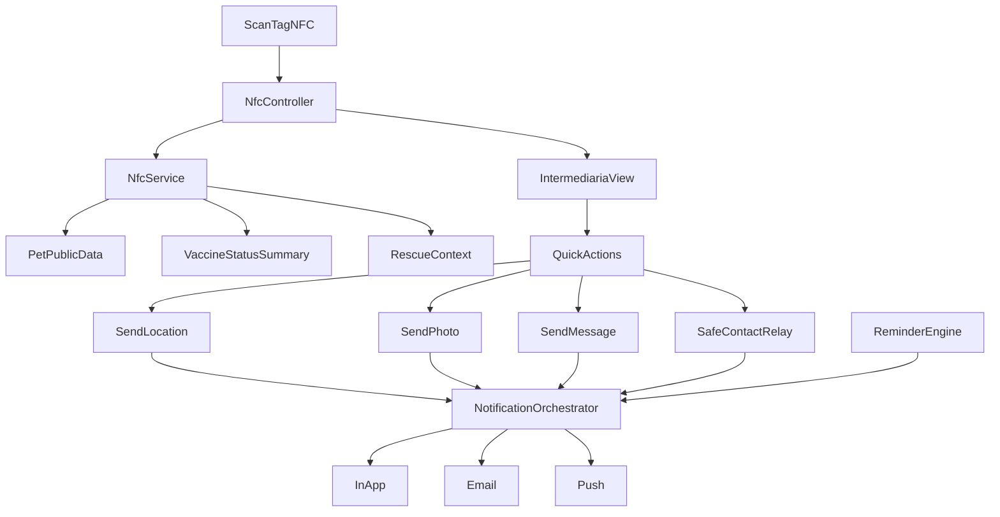

# Plano de foco: Tag NFC sem Rede Social

## Objetivo

Entregar uma experiência de tag NFC de alto nível, centrada em resgate rápido e rotina do tutor, com UX premium, segurança de dados e notificações multicanal confiáveis (app, e-mail e push).

## Estado atual (já existe)

- Fluxo de scan público com tela intermediária e ações de ajuda (`/tag/:tag_code`) em [C:/Users/u17789/Desktop/vevo/AIRPET/src/controllers/nfcController.js](C:/Users/u17789/Desktop/vevo/AIRPET/src/controllers/nfcController.js) e [C:/Users/u17789/Desktop/vevo/AIRPET/src/views/nfc/intermediaria.ejs](C:/Users/u17789/Desktop/vevo/AIRPET/src/views/nfc/intermediaria.ejs).
- Ativação/vinculação da tag já estruturada em [C:/Users/u17789/Desktop/vevo/AIRPET/src/controllers/tagController.js](C:/Users/u17789/Desktop/vevo/AIRPET/src/controllers/tagController.js).
- Carteira de saúde com vacinas e registros já existe em [C:/Users/u17789/Desktop/vevo/AIRPET/src/views/pets/saude.ejs](C:/Users/u17789/Desktop/vevo/AIRPET/src/views/pets/saude.ejs) e [C:/Users/u17789/Desktop/vevo/AIRPET/src/controllers/saudeController.js](C:/Users/u17789/Desktop/vevo/AIRPET/src/controllers/saudeController.js).

## Escopo aprovado para esta fase

- Perfil público do pet ao escanear: **nível intermediário**
  - Exibir alertas críticos (alergias/medicações/restrições)
  - Exibir status resumido de vacinas (em dia/pendente), sem histórico completo
- Lembretes: **app + e-mail + push** para ração, vacina e consulta.

## Visão de experiência (UX de outro nível)

- Tela pública com hierarquia clara em 3 blocos:
  - **Ação imediata**: ligar/contato protegido, enviar localização, enviar foto, mensagem rápida
  - **Segurança clínica**: alergias, medicação contínua, restrições alimentares, status de vacina
  - **Confiança e contexto**: última região/cidade conhecida, status do alerta, orientação curta para quem encontrou
- Fluxo em no máximo **2 toques** para a ação principal do visitante.
- Texto humano e orientado a tarefa, com microcopy de emergência e estados de erro amigáveis.
- Design consistente com foco em legibilidade em ambiente externo (luz forte, conexão ruim, pressa).

## Arquitetura funcional proposta

## Entregas por prioridade (completas)

1. **Perfil público de resgate mais completo (scan)**
  - Ajustar payload do scan para incluir:
    - Dados críticos de saúde
    - Indicador simples de vacina (ex.: “Em dia”, “Próxima dose”, “Atrasada”)
    - Bloco “Como ajudar agora” (ligar, enviar localização, enviar foto, mensagem)
    - Checklist rápido para o visitante (“mantenha em local seguro”, “evite alimentar sem orientação”)
  - Atualizar a view pública para destacar informação de ação imediata.
  - Incluir status de alerta de pet perdido e destaque de recompensa quando existir.
  - Implementar contato protegido (relay) para não expor telefone direto.
2. **Módulo de lembretes do tutor**
  - Criar entidade de lembrete recorrente e avulso (tipo: `racao`, `vacina`, `consulta`).
  - Criar CRUD básico na área do tutor (listar/criar/editar/desativar).
  - Definir janela de disparo (ex.: antecipação e horário preferencial).
  - Incluir regras por tipo:
    - `racao`: recorrência diária/semanal e estoque previsto
    - `vacina`: datas futuras e reforço por protocolo
    - `consulta`: check-up periódico com antecedência configurável
  - Criar “Centro de pendências do pet” com status acionável (ok, próximo, atrasado).
3. **Orquestração de notificações multicanal**
  - Reusar `notificacaoService` para in-app.
  - Integrar e-mail via `emailService` e push via `pushService` no mesmo evento.
  - Implementar regra anti-duplicidade para não enviar lembretes repetidos no mesmo período.
  - Implementar escalonamento:
    - Disparo inicial push + in-app
    - Fallback para e-mail se não houver abertura/interação em janela definida
    - Novo lembrete controlado por cooldown para evitar spam
  - Persistir status de entrega por canal para auditoria (enviado/falhou/retry).
4. **Experiência e segurança**
  - No perfil público, nunca exibir dado sensível além do necessário para resgate.
  - Limitar quantidade de ações/inputs de visitante para evitar spam.
  - Mensagens de fallback quando canal de notificação falhar (ex.: push indisponível).
  - Rate limit e proteção anti-abuso em endpoints públicos (mensagem/foto/localização).
  - Honeypot/campos invisíveis e validação de payload para reduzir bots.
5. **Ciclo completo de resgate**
  - Criar fluxo de “Pet devolvido”:
    - Tutor confirma devolução
    - Alerta de perdido é encerrado
    - Notificações pendentes relacionadas são canceladas/silenciadas
  - Guardar histórico privado de avistamentos para análise pós-evento.
6. **Co-responsáveis e rede de apoio**
  - Permitir cadastro de contatos de confiança (cuidador/familiar).
  - Configurar quais alertas cada contato recebe (scan, perdido, lembretes de rotina).
  - Garantir revogação simples de acesso por parte do tutor.

## Roadmap de implementação (fases)

### Fase 1 (MVP forte de resgate)

- Enriquecer tela pública com dados críticos + status de vacina + checklist + contato protegido.
- Melhorar CTA e feedback visual para enviar localização/foto/mensagem.
- Adicionar proteção anti-spam e telemetria básica do funil.

### Fase 2 (rotina do tutor)

- Entidade e CRUD de lembretes para ração/vacina/consulta.
- Centro de pendências no perfil do pet.
- Disparo multicanal com anti-duplicidade.

### Fase 3 (excelência operacional)

- Escalonamento de canal por abertura/interação.
- Fluxo de confirmação de resgate e encerramento automático.
- Contatos de apoio e timeline privada completa.

## Arquivos-alvo iniciais

- Scan público e composição de dados:
  - [C:/Users/u17789/Desktop/vevo/AIRPET/src/controllers/nfcController.js](C:/Users/u17789/Desktop/vevo/AIRPET/src/controllers/nfcController.js)
  - [C:/Users/u17789/Desktop/vevo/AIRPET/src/services/nfcService.js](C:/Users/u17789/Desktop/vevo/AIRPET/src/services/nfcService.js)
  - [C:/Users/u17789/Desktop/vevo/AIRPET/src/views/nfc/intermediaria.ejs](C:/Users/u17789/Desktop/vevo/AIRPET/src/views/nfc/intermediaria.ejs)
- Saúde e status de vacina:
  - [C:/Users/u17789/Desktop/vevo/AIRPET/src/controllers/saudeController.js](C:/Users/u17789/Desktop/vevo/AIRPET/src/controllers/saudeController.js)
  - [C:/Users/u17789/Desktop/vevo/AIRPET/src/models/Vacina.js](C:/Users/u17789/Desktop/vevo/AIRPET/src/models/Vacina.js)
- Lembretes e notificações:
  - [C:/Users/u17789/Desktop/vevo/AIRPET/src/services/notificacaoService.js](C:/Users/u17789/Desktop/vevo/AIRPET/src/services/notificacaoService.js)
  - [C:/Users/u17789/Desktop/vevo/AIRPET/src/services/emailService.js](C:/Users/u17789/Desktop/vevo/AIRPET/src/services/emailService.js)
  - [C:/Users/u17789/Desktop/vevo/AIRPET/src/services/pushService.js](C:/Users/u17789/Desktop/vevo/AIRPET/src/services/pushService.js)
  - [C:/Users/u17789/Desktop/vevo/AIRPET/src/routes/notificacaoRoutes.js](C:/Users/u17789/Desktop/vevo/AIRPET/src/routes/notificacaoRoutes.js)
- Apoio de persistência/modelagem:
  - [C:/Users/u17789/Desktop/vevo/AIRPET/src/models/Notificacao.js](C:/Users/u17789/Desktop/vevo/AIRPET/src/models/Notificacao.js)
  - [C:/Users/u17789/Desktop/vevo/AIRPET/src/models/Pet.js](C:/Users/u17789/Desktop/vevo/AIRPET/src/models/Pet.js)

## Requisitos de UX/Design (Definition of Experience)

- Tempo de compreensão da tela pública em até 3 segundos (nome do pet + ação principal).
- Botões de ação com área de toque confortável e contraste alto.
- Estado offline/degradado com mensagens úteis e tentativa de reenvio.
- Linguagem sem jargão técnico para visitante e clara para tutor.
- Continuidade visual entre tela pública da tag e área privada do pet.

## Métricas de sucesso

- Taxa de clique em ação principal na tela de scan.
- Tempo médio entre scan e primeira ação (ligar/localização/mensagem).
- Taxa de entrega de lembretes por canal (in-app/e-mail/push).
- Redução de lembretes duplicados e taxa de resolução (pet devolvido).
- Taxa de conversão de “pet encontrado” para “resgate confirmado”.

## Critérios de pronto

- Ao escanear a tag ativa, a pessoa vê dados críticos + status resumido de vacina + ações de ajuda em 1 tela.
- Tutor consegue cadastrar lembretes de ração/vacina/consulta.
- Cada lembrete pode disparar em app, e-mail e push sem duplicidade no mesmo ciclo.
- Fluxo mantém privacidade e não depende de funcionalidades de rede social.
- Existe fluxo explícito de encerramento de resgate e cancelamento de notificações correlatas.
- Design/UX validado com checklist de legibilidade, rapidez de ação e anti-abuso.

