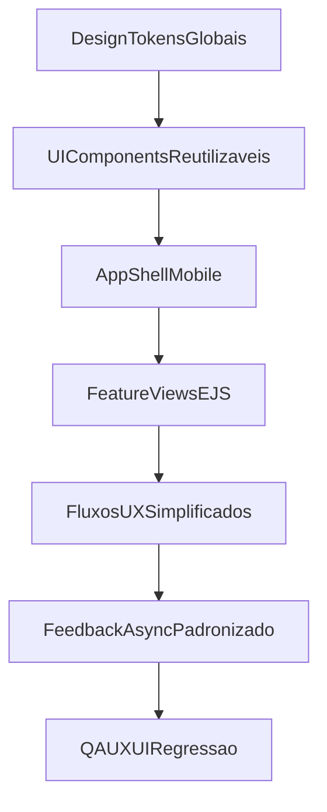

# Plano de Reformulação UX/UI Mobile-First (AIRPET)

## Escopo e Direção

- Escopo: todas as views/telas do projeto, exceto Home/Landing inicial.
- Direção visual: inspiração em apps modernos (padrões iOS + Material 3), adaptado para identidade AIRPET.
- Stack atual mantida: Express + EJS + Tailwind, com refatoração estrutural front-end.

## Diagnóstico Consolidado (estado atual)

- Há fragmentação visual entre estilos globais e estilos locais inline, causando inconsistência de componentes e hierarquia.
- Navegação mobile está densa em algumas áreas, elevando fricção e custo cognitivo.
- Fluxos críticos (registro, feed, parceiro) concentram excesso de informação e ações simultâneas.
- Feedback de estado (loading/erro/sucesso) não está uniformizado em todas as ações async.

Arquivos-chave para base do redesign:

- Layout e navegação: [C:/Users/u17789/Desktop/vevo/AIRPET/src/views/partials/header.ejs](C:/Users/u17789/Desktop/vevo/AIRPET/src/views/partials/header.ejs), [C:/Users/u17789/Desktop/vevo/AIRPET/src/views/partials/nav.ejs](C:/Users/u17789/Desktop/vevo/AIRPET/src/views/partials/nav.ejs)
- Tokens e estilos globais: [C:/Users/u17789/Desktop/vevo/AIRPET/src/public/css/design-system.css](C:/Users/u17789/Desktop/vevo/AIRPET/src/public/css/design-system.css), [C:/Users/u17789/Desktop/vevo/AIRPET/src/public/css/theme-override.css](C:/Users/u17789/Desktop/vevo/AIRPET/src/public/css/theme-override.css), [C:/Users/u17789/Desktop/vevo/AIRPET/src/public/css/input.css](C:/Users/u17789/Desktop/vevo/AIRPET/src/public/css/input.css)
- Rotas e composição de views: [C:/Users/u17789/Desktop/vevo/AIRPET/src/routes/index.js](C:/Users/u17789/Desktop/vevo/AIRPET/src/routes/index.js)

## Estratégia de Execução

### Fase 1 - Fundação visual e comportamental

- Consolidar um design system único (tokens de cor, tipografia, espaçamento, raio, sombras, estados).
- Reduzir overrides agressivos e `!important`, definindo uma cascata previsível.
- Padronizar componentes base: botão, input, select, textarea, card, badge, tabs, modal, bottom-sheet, toast, empty/error/loading state.
- Definir regras de microinteração e acessibilidade (focus visível, contraste, tamanhos de toque, feedback imediato).

### Fase 2 - Navegação mobile-first

- Reestruturar navegação inferior para 4-5 destinos fixos + hub contextual (evitando saturação de ações).
- Normalizar App Shell mobile (header contextual, área de conteúdo, barra inferior sticky, safe-areas).
- Aplicar padrão de ações primárias thumb-friendly (CTAs na zona de alcance do polegar).

### Fase 3 - Refatoração dos fluxos críticos

- Auth: dividir registro em etapas para reduzir fricção e abandono.
- Feed/Explorar: reduzir densidade de ações visíveis por card; priorizar CTA principal e secundárias em menu.
- Pets/NFC: simplificar fluxos de ativação e vinculação com progressão clara e estados explícitos.
- Parceiro/Petshop-panel: separar edição/publicação/gestão em subfluxos objetivos.
- Perfil/Configurações: unificar layout de settings e padrões de formulário.

### Fase 4 - Escalabilidade front-end

- Extrair blocos repetidos para partials EJS reutilizáveis por domínio.
- Organizar JS por feature (sem scripts longos inline por tela).
- Criar contrato de UI async reutilizável (loading, erro, retry, sucesso) para toda ação mutável.
- Eliminar duplicações visuais e de comportamento entre módulos.

### Fase 5 - QA UX/UI e regressão

- Checklist de consistência visual por tela (spacing, tipografia, contraste, estados).
- Checklist de usabilidade mobile (navegação com uma mão, tempo de conclusão de tarefa, clareza de CTA).
- Teste de regressão funcional por fluxo crítico.

## Priorização (Impacto x Esforço)

1. Unificação de design tokens e componentes base.
2. Reestruturação da bottom navigation e app shell mobile.
3. Refatoração de `auth/registro`, `feed`, `petshop-panel/perfil`.
4. Padronização de feedback async e tratamento de erro visível.
5. Componentização progressiva das demais views.

## Arquitetura alvo (visão simplificada)

## Entregáveis

- Versões reformuladas de todas as views (exceto Home/Landing).
- Design system aplicado de forma consistente no projeto.
- Fluxos críticos simplificados com justificativa UX por decisão.
- Estrutura front-end mais modular e escalável (partials + JS por feature).
- Documento de melhoria contínua com próximos incrementos UX/UI.

