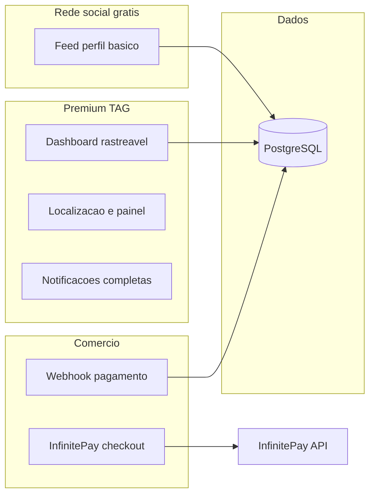
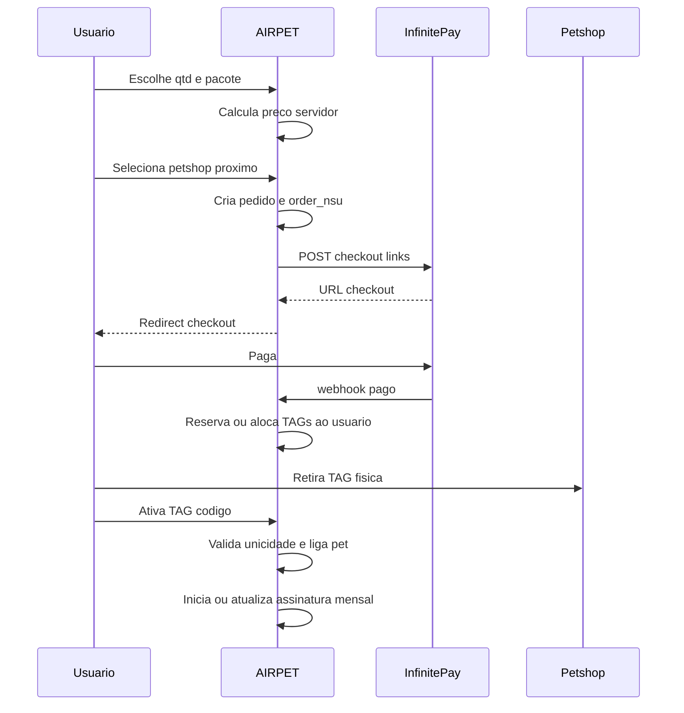

# Plano: SaaS de TAG NFC integrado à rede social pet (AIRPET)

## Premissas alinhadas ao código atual

- Stack existente: monólito **Node/Express**, views **EJS**, **PostgreSQL** (SQL em `[src/models](src/models)`), já há domínio **NFC** (`[NfcTag.js](src/models/NfcTag.js)`, `[nfcService.js](src/services/nfcService.js)`) e **petshops** (`[contexto_do_projeto.md](contexto_do_projeto.md)`).
- Pagamento: API **InfinitePay** descrita em `[.cursor/plans/INFINITYPAY.MD](.cursor/plans/INFINITYPAY.MD)`: `POST https://api.infinitepay.io/invoices/public/checkout/links`, `order_nsu`, `redirect_url` com query params, `payment_check`, `webhook_url` com corpo incluindo `order_nsu` e `transaction_nsu`, preços em **centavos**.

---

## 1. Arquitetura do sistema

**Princípio:** separar conceitualmente (e na permissão de rotas) **rede social gratuita** vs. **módulo premium TAG** — sem duplicar usuários; o mesmo `usuario` ganha “entitlements” quando possui TAG ativa + assinatura em dia.

**Camadas sugeridas (dentro do monólito atual):**

| Camada                               | Responsabilidade                                                                                                                                                                                  |
| ------------------------------------ | ------------------------------------------------------------------------------------------------------------------------------------------------------------------------------------------------- |
| **Middleware de entitlement**        | Bloqueia rotas premium se não houver TAG ativa vinculada ao pet (ou ao usuário, conforme modelagem) e assinatura válida.                                                                          |
| **Serviço de precificação**          | Calcula carrinho (TAGs, pacotes, desconto >4, snapshot persistido no pedido).                                                                                                                     |
| **Serviço de pedidos + InfinitePay** | Cria pedido interno, gera `order_nsu`, chama API de link, persiste `slug`/URL de retorno.                                                                                                         |
| **Webhook + idempotência**           | Processa pagamento aprovado uma vez por `transaction_nsu` ou `order_nsu` (tabela de idempotência, padrão já citado para API em `[ApiIdempotencyResponse](src/models/ApiIdempotencyResponse.js)`). |
| **Serviço de assinatura**            | Calcula mensalidade: base R$ 19,90 + (N−1) × R$ 5,00; agenda próxima cobrança; emite novo link ou integra recorrência (ver riscos abaixo).                                                        |
| **Serviço de ativação TAG**          | Liga `tag_code` física ↔ usuário comprador ↔ pet, com validação única.                                                                                                                            |

**Escalabilidade:** manter lógica pesada em serviços; índices e constraints no PG; filas opcionais (jobs de cobrança, e-mails) se o volume crescer — sem microserviço obrigatório na fase 1.

**Recorrência e InfinitePay:** a documentação em [INFINITYPAY.MD](.cursor/plans/INFINITYPAY.MD) descreve **checkout por link** e webhook para **pagamento concluído**, não assinatura recorrente automática explícita. No plano de implementação, tratar a mensalidade como uma destas opções: (a) confirmação com InfinitePay se existe produto/recorrência nativa; (b) **cobrança mensal via novo link** gerado por job (e-mail/app) + mesmo fluxo webhook; (c) PSP com assinatura nativa só para a parte recorrente. Registrar a decisão antes de codificar a assinatura.

---

## 2. Modelagem de banco de dados

**Entidades novas ou estendidas (conceitual):**

1. `**tag_product_orders`** (ou nome alinhado ao projeto)
  - `id`, `usuario_id` (comprador obrigatório), `status` (rascunho, aguardando_pagamento, pago, cancelado, expirado)  
  - `quantidade_tags`, `preco_total_centavos`, `snapshot_json` (regras aplicadas no momento da compra)  
  - `petshop_retirada_id` (FK `petshops`)  
  - `infinitepay_order_nsu` (único), `checkout_url`, `invoice_slug`, metadados de redirect  
  - `paid_at`, `transaction_nsu` (última transação confirmada)
2. `**tag_order_items`** (opcional se precisar linha a linha para NF/itens)
  - Referência ao pedido, descrição, `price_centavos`, `quantity`.
3. `**nfc_tags**` (evolução da tabela existente)
  - Garantir: `tag_code` **UNIQUE** global; estados: `em_estoque`, `reservada_pedido`, `ativa`, `revogada`  
  - `owner_usuario_id` (quem comprou — não confundir com vínculo ao pet)  
  - `pet_id` (nullable até ativar)  
  - `order_id` (qual pedido liberou a unidade)  
  - `activated_at`, `activation_secret_hash` ou fluxo só com código de ativação já existente no model.
4. `**tag_subscriptions`**
  - `usuario_id` (ou `pet_id` se a cobrança for por pet — preferir **por usuário** se N TAGs são todas dele: uma linha com `tag_count` e valor mensal calculado)  
  - `monthly_amount_centavos`, `tag_count_snapshot`  
  - `status` (ativa, em_atraso, cancelada)  
  - `current_period_start`, `current_period_end`  
  - `last_invoice_slug` / referências InfinitePay  
  - Índice por `usuario_id` + `status`.
5. `**pet_notification_contacts`** (até 2 por pet)
  - `pet_id`, `email` ou `usuario_id` (se convidado for usuário registrado), `telefone`, `confirmado_em`, UNIQUE (`pet_id`, ordem ou limite 2 via constraint/trigger).
6. `**petshops`**
  - Campos para **ponto de retirada TAG**: `aceita_retirada_tag` (boolean), eventual `instrucoes_retirada` — se ainda não existirem.
7. **Auditoria / anti-fraude**
  - `tag_activation_attempts` (opcional): `tag_code`, `ip`, `usuario_id`, `resultado` — rate limit complementar no banco.

**Regras de integridade:**  

- Uma `tag_code` → no máximo um vínculo ativo de propriedade.  
- Pedido sempre com `usuario_id` = sessão autenticada (sem “presente” para terceiro na v1).

---

## 3. Fluxo do usuário (compra até ativação)

**Passos detalhados:**

1. **Navegação:** usuário logado acessa “Loja TAG” → quantidade/pacote → **cálculo dinâmico** exibido (espelhar regras do servidor, nunca confiar só no front).
2. **Petshop:** lista filtrada por proximidade (PostGIS já no projeto) + endereço formatado + talvez horário.
3. **Checkout:** backend cria registro de pedido, `order_nsu` = id estável (ex.: `tag-{uuid}` ou id numérico com prefixo), chama InfinitePay com `items[]` em centavos, `customer` pré-preenchido, `redirect_url` da aplicação, `webhook_url` interna.
4. **Pós-pagamento:** webhook e/ou `payment_check` na `redirect_url` (validar `paid`); transição do pedido para `pago`; reserva de N unidades de TAG do estoque do lote ou geração de códigos pré-impressos — **processo operacional** deve estar definido (estoque físico no petshop vs. central).
5. **Retirada:** petshop confirma entrega (painel parceiro ou checklist admin na v1 mínima).
6. **Ativação:** usuário informa código da TAG; servidor valida que a TAG está **alocada ao seu `usuario_id`** e associa ao `pet` escolhido; bloqueia segunda ativação.
7. **Assinatura:** após primeira TAG ativa (ou após pagamento, conforme política), registrar `tag_subscriptions` e cobrar primeira mensalidade (momento exato: alinhar com financeiro — pode ser após ativação para não cobrar sem hardware em mãos).

---

## 4. Regras de segurança detalhadas

| Área                    | Medida                                                                                                                                                                                                          |
| ----------------------- | --------------------------------------------------------------------------------------------------------------------------------------------------------------------------------------------------------------- |
| **Propriedade TAG**     | Toda escrita de vínculo `tag_code` ↔ `pet` exige `usuario_id` = dono da TAG (derivado do pedido pago).                                                                                                          |
| **Anti-duplicação**     | `UNIQUE(tag_code)` onde representa hardware; ativação em transação com `SELECT ... FOR UPDATE` na linha da TAG.                                                                                                 |
| **API pública de scan** | Perfil “completo” e localização só se política de privacidade permitir; **mínimo:** não expor painel do dono sem autenticação; QR/NFC pode mostrar fluxo “pet encontrado” sem igualar ao dashboard autenticado. |
| **Pedidos**             | `order_nsu` só aceita webhook se existir pedido pendente e valores batem com snapshot (anti-tamper).                                                                                                            |
| **Webhook**             | Verificar assinatura se InfinitePay fornecer; senão, validar consistência com `payment_check` e idempotência.                                                                                                   |
| **Rate limit**          | Endpoints de ativação e scan com limites (já há cultura de rate limit no projeto).                                                                                                                              |
| **Dados de terceiros**  | Os 2 contatos extras: consentimento explícito (LGPD) e confirmação de e-mail/SMS se necessário.                                                                                                                 |

---

## 5. Estrutura de telas (frontend EJS + JS)

Todas como rotas autenticadas salvo landing pública de marketing da TAG.

| Tela                                | Objetivo                                                                                                                                                |
| ----------------------------------- | ------------------------------------------------------------------------------------------------------------------------------------------------------- |
| **Loja / carrinho TAG**             | Stepper: quantidade → simulação de preço (chamada API) → pacotes sugeridos → CTA checkout.                                                              |
| **Seleção de petshop**              | Mapa ou lista + endereço + distância; confirmação.                                                                                                      |
| **Pós-compra / status**             | Estado do pedido, link para comprovante (`receipt_url`), instruções de retirada.                                                                        |
| **Dashboard “Meus pets” (premium)** | Lista de pets com indicador TAG ativa/inativa; entrada para localização/notificações só se entitlement OK.                                              |
| **Ativação da TAG**                 | Formulário de código; feedback de erro específico (já vinculada, inválida).                                                                             |
| **Gestão de contatos extras**       | Até 2 contatos por pet; adicionar/remover com validação.                                                                                                |
| **Assinatura**                      | Valor atual mensal, data de renovação, histórico de pagamentos (quando houver), ação “atualizar pagamento” / “pagar agora” se o modelo for link mensal. |
| **Petshop (parceiro)**              | (Se escopo) lista de pedidos para retirada na loja — pode ser MVP em planilha + admin interno.                                                          |

**UI:** reutilizar design system existente (`[contexto_do_projeto.md](contexto_do_projeto.md)` — Tailwind + tokens); JS vanilla por página, sem novo framework.

**Motor de preço (servidor):**  

- TAG avulsa referência R$ 49,90; pacotes 2 = R$ 80,00; 4 = R$ 149,90; se total de TAGs no carrinho > 4, preço unitário R$ 15,00 cada (definir precedência explícita se pacote e desconto conflitarem — documentar regra única).  
- Mensal: `1990 + max(0, N-1)*500` centavos.

---

## 6. Estratégia para validar o produto com primeiros clientes

- **Cohort fechado:** 1–2 petshops parceiros com estoque mínimo e fluxo de retirada ensaiado.  
- **Métricas de funil:** visita loja → checkout iniciado → pago → retirou → ativou → usou scan em campo (eventos simples em tabela ou analytics existente).  
- **Feedback qualitativo:** entrevista curta pós-ativação (NPS + “o que faltou”).  
- **Operação enxuta:** suporte WhatsApp/e-mail com SLA honesto; FAQ de retirada e primeira ativação.  
- **Critério de sucesso inicial:** taxa de conversão checkout→pagamento e pagamento→ativação em X semanas, não só “vendas brutas”.

---

## 7. Possíveis problemas e riscos

| Risco                                            | Mitigação                                                                                   |
| ------------------------------------------------ | ------------------------------------------------------------------------------------------- |
| **InfinitePay sem assinatura recorrente nativa** | Job mensal + links de pagamento + webhook; ou PSP complementar só para mensalidade.         |
| **Sincronismo estoque físico vs. sistema**       | Estados `reservada`/`entregue`; conferência petshop; reconciliação manual no MVP.           |
| **Fraude / múltipla ativação**                   | Constraint DB + transação + auditoria de tentativas.                                        |
| **Complexidade de preço**                        | Testes unitários do serviço de preço + snapshots no pedido.                                 |
| **Escopo creep**                                 | Entregar compra + webhook + ativação + bloqueio de rotas premium antes de refinar parceiro. |
| **LGPD**                                         | Contatos extras e localização com bases legais e configurações de visibilidade.             |

---

## Ordem sugerida de implementação (fases)

1. Schema + modelos + serviço de precificação + testes manuais/automáticos do cálculo.
2. Pedido + integração InfinitePay (link + webhook + `payment_check`) + tela checkout redirect.
3. Alocação de TAG ao usuário + fluxo ativação + middleware premium.
4. Assinatura (conforme decisão de recorrência) + tela de assinatura.
5. Petshops próximos + seleção + instruções de retirada.
6. Contatos extras + notificações.
7. Hardening, métricas e piloto com parceiros.

Este plano é deliberadamente alinhado ao repositório AIRPET e à [documentação InfinitePay](.cursor/plans/INFINITYPAY.MD) para reduzir surpresas na integração de pagamento.