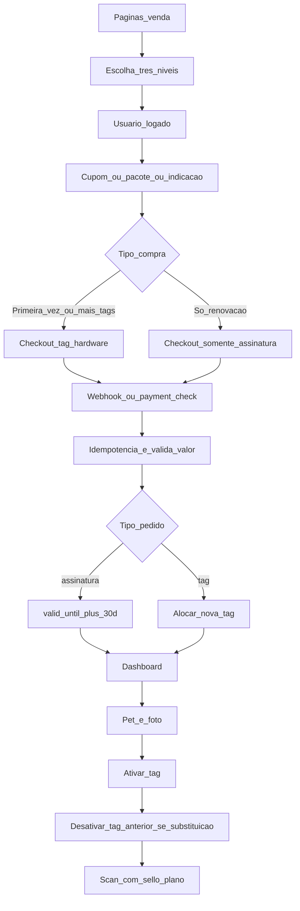

# Plano: TAG NFC paga + personalização + vendas + plano 30 dias + antifraude

## Relação entre os planos existentes

- **[foco_tag_nfc_sem_rede_22b6d103.plan.md](.cursor/plans/foco_tag_nfc_sem_rede_22b6d103.plan.md)** — pós-ativação: scan rico, lembretes, privacidade ([`src/services/nfcService.js`](src/services/nfcService.js), [`src/views/nfc/intermediaria.ejs`](src/views/nfc/intermediaria.ejs)).
- **[saas_tag_nfc_premium_6e2f2e11.plan.md](.cursor/plans/saas_tag_nfc_premium_6e2f2e11.plan.md)** — comércio, InfinitePay, alocação, petshop.

**Nota:** [.cursor/plans/INFINITYPAY.MD](.cursor/plans/INFINITYPAY.MD) está **vazio no repositório**. Antes de codificar, preencher com o contrato oficial (URLs, headers, assinatura de webhook, exemplos). Referência provisória já descrita no plano SaaS: `POST https://api.infinitepay.io/invoices/public/checkout/links`, `order_nsu`, `redirect_url` + `payment_check`, `webhook_url`, valores em **centavos**, corpo com `order_nsu` / `transaction_nsu`.

---

## Pré-implementação: o que precisa de atenção (reforçado)

Resumo do que já está bom no plano: ciclo **venda → pagamento → ativação → scan**, antifraude na integração, **matriz de recursos** e fluxo ordenado. Abaixo, o que **não pode ir para código sem estar fechado** — evita retrabalho e incidente em produção.

| Tema | Por que importa | Ação antes de codar |
|------|-----------------|---------------------|
| **Contrato InfinitePay** | Endpoint, headers, corpo do webhook e `payment_check` errados geram cobrança não reconhecida ou duplicada. | Preencher [INFINITYPAY.MD](.cursor/plans/INFINITYPAY.MD) com doc oficial + 1 exemplo real (request/response) + o que fazer em disputa. |
| **Regra de renovação dos 30 dias** | Usuário e suporte precisam da mesma história; evita “sumiram meus dias”. | Fechar fórmula única (ver **Riscos e decisões** abaixo) e copiar **literalmente** para landing, checkout e FAQ. |
| **Fonte da verdade no servidor** | Front pode ser alterado; plano “ativo” falsificado em `localStorage`/`sessionStorage`. | Toda decisão de premium: ler **`valid_until` + `plan_slug` no PG** (e grace) em middleware, `nfcService` e jobs. Front só exibe o que a API mandou. |
| **Grace period (48–72h)** | Cartão atrasado, fuso, webhook lento — churn e pânico do tutor. | Definir `grace_until` (ou `now <= valid_until + interval`) e **nível de serviço durante grace** (ex.: scan completo vs. só básico). Documentar para suporte. |
| **JWT / tokens curtos** | JWT longo = janela grande se vazar; não substitui assinatura. | Se usar JWT (app/API): **vida curta** (ex. 15 min–1 h) + refresh controlado; claims **nunca** são autoridade final — sempre validar plano no banco na operação sensível. Preferir sessão `httpOnly` no web. |
| **Teto 10 pets por usuário** | Limite comercial explícito no teu resumo. | Validar no **checkout**, **ativação de TAG paga** e (se aplicável) **cadastro do 11º pet**; mensagens claras na loja e no dashboard. |
| **Documentação pré-produção** | On-call e financeiro dependem disso. | Runbook: reprocessar webhook, cancelar pedido, estorno; checklist de go-live (abaixo). |

---

## Páginas de venda (deixar explícito)

Objetivo: usuário entender **o que compra**, **por quanto tempo vale**, **o que a tag mostra** e **como renovar**.

| Página | Conteúdo mínimo |
|--------|------------------|
| **Landing TAG** (`/tag` ou `/loja-tag`) | Proposta de valor (resgate + identificação), como funciona em 3 passos, prova social opcional, CTA “Ver planos” / “Comprar”. |
| **Planos e preços** | Tabela comparativa dos **tiers** (ver seção abaixo): o que cada um libera (scan básico vs. completo, busca, mapa, notificações). |
| **Checkout** | Distinguir **1ª compra / nova tag** (carrinho com hardware + 1º período ou só hardware conforme precificação) vs **renovação** (só assinatura, sem tag nova). Texto legal: **assinatura em ciclo de 30 dias**; **nova compra de tag** só quando o tutor quiser **outra tag** — a tag **anterior** (substituída) é **desativada** no sistema. Se assinatura vencer: tag física existe, serviço premium degrada após `valid_until` + grace. |
| **Pós-pagamento** | Estado do pedido + próximos passos (personalização, retirada, ativação) — já previsto no fluxo dashboard. |

Design: reaproveitar Tailwind/partials existentes; hierarquia visual forte (preço, duração do plano, “inclui X dias de serviço”).

---

## Plano ativo: ciclo de 30 dias e renovação por pagamento

**Regra de negócio (fonte da verdade no servidor):**

- **Regra de renovação fechada (recomendada):** a cada pagamento aprovado, `valid_until_novo = max(valid_until_atual, data_hora_confirmacao_pagamento) + 30 dias`. Assim **não se perdem dias já pagos** (renovação antecipada **empilha** sobre o saldo restante). Alternativa rara: sempre `paid_at + 30d` (ignora saldo) — só usar se negócio exigir; se escolher, comunicar com muito destaque.
- **Não** usar apenas JWT no browser como prova de assinatura: token pode ser **complemento** (ex.: cookie de sessão), mas **middleware e scan** consultam **PostgreSQL** (`tag_subscriptions` / `usuario_entitlements` ou campos em `usuarios`).

**Renovação (só assinatura):** cobranças seguintes **não** incluem hardware — apenas estendem `valid_until` (+ regra dos 30 dias). Link InfinitePay / fatura recorrente conforme modelo escolhido.

**Compra de nova tag (substituição):** fluxo de pedido separado (ou item tipo `hardware_tag` no checkout). Após pagamento e ativação da **nova** tag no pet, a **tag antiga** daquele vínculo passa a `blocked`/`revogada`/`substituida` (definir status único), **desvinculada** ou redirecionando scan para mensagem “Tag substituída — use a nova tag”. Evita duas tags ativas com o mesmo propósito para o mesmo pet (ajustar se a política for **N pets = N tags** sem substituir todas de uma vez).

**Indicador na tag (público):** ao montar dados em [`nfcService.processarScan`](src/services/nfcService.js), incluir flags derivadas do servidor, por exemplo:

- `planoAtivo: boolean` = considerar **`valid_until` + grace** (ex.: premium efetivo até `valid_until + 72h` se essa for a política).
- `planoExpiraEm: date | null` (opcional, para microcopy “Serviço premium ativo até …”; em grace pode mostrar “Renove em até X para não perder …”).

Assim a **tela intermediária** pode mostrar selo **“Dentro do plano”** ou **“Plano inativo — contato básico”** sem depender de cliente adulterar token.

**Token / JWT (segurança):** o **período comercial de 30 dias** vive no **PG** (`valid_until`), não no JWT.

- **JWT** (se existir): expiração **curta** (ordem de **15 min a 1 h**); uso principal identificar sessão/dispositivo, **não** substituir consulta a `valid_until` + grace em rotas premium e no fluxo de scan enriquecido.
- **Token opaco** (link mágico, API): mesma lógica — revogável em tabela, validação sempre cruzada com plano no servidor.
- Sessão web: cookie **httpOnly** + **secure** em produção.

---

## Matriz sugerida: planos e “busca” / serviços

Alinhar com o que já existe no código para não prometer o que não existe na v1:

| Recurso | Onde hoje | Sugestão de tier |
|---------|-----------|-------------------|
| Scan NFC público + dados básicos do pet | [`nfcService`](src/services/nfcService.js) | **Base** (sempre, ou mínimo se tag ativa) |
| Scan com painel “completo” (localização, ações extras, etc.) | Plano foco sem rede | **Premium** |
| Busca social / explorar pets e usuários | [`explorarController.paginaBusca`](src/controllers/explorarController.js) | **Gratuita** (decisão: não exigir plano TAG; premium concentra scan completo, mapa/resgate avançado, notificações) |
| Formulário pet perdido (mapa, busca endereço) | [`pets-perdidos/formulario.ejs`](src/views/pets-perdidos/formulario.ejs) | Premium para **prioridade** ou mapa avançado; base só alerta simples |
| Sugestão petshop próximo no contexto de resgate | [`petshopRecoveryIntegrationService`](src/services/petshopRecoveryIntegrationService.js) | Premium |
| Notificações completas multicanal | Plano foco | Premium |

**Entrega:** documentar a matriz em código (`config/planos.js` ou tabela `plan_definitions`) para **uma única fonte** usada pela landing, pelo middleware e pelo `nfcService` (feature flags por `plan_slug`).

**Nota:** com **3 níveis pagos** (decisão abaixo), esta tabela vira **3 colunas** (ou mais): cada recurso marca se entra em Básico, Plus e/ou Família — ainda **pendente preencher célula a célula** com o sócio/produto.

---

## Planos comerciais e promoções (decisões fechadas e pendentes)

### O que já foi definido (produto)

| Decisão | Escolha |
|---------|---------|
| **Quantidade de planos pagos na v1** | **3 níveis** (ex.: linha Básico / Plus / Família — **nomes finais e preços a fechar**). |
| **Modelo de cobrança** | **Tag física = compra única** (paga uma vez por unidade). **Todo o restante = só assinatura** (renovações mensais 30 dias). **Próxima “compra” de tag** só se o tutor quiser **outra tag**; nesse caso a tag **anterior** (a que estava em uso e é substituída) é **desativada** no app. Sem assinatura ativa: degradar serviço premium após `valid_until` + grace (hardware continua existindo). |
| **Promoções na v1** | (1) **Pacotes por quantidade** de tags (ex. 2 e 4 unidades, desconto progressivo); (2) **Cupom** (% ou valor fixo); (3) **Indicação** (crédito para quem indica e/ou indicado — **regra exata pendente**). |

### O que ainda falta fechar (para o plano ficar “completo”)

Sugestão: responder numa próxima rodada (chat ou doc) cada item — vira critério de aceite da loja.

1. **Nomes e preço de tabela** dos 3 planos: mensalidade cada um? na **primeira adesão**, tag(s) entra(m) no mesmo checkout da 1ª mensalidade ou tag à vista + assinatura separada?
2. **Distribuição de recursos** da matriz (scan rico, mapa perdido, petshop próximo, notificações, contatos extras, etc.) por plano — quem fica só no Plus/Família?
3. **Cupom:** duração, uso único por CPF/e-mail, combina com pacote de tags ou é um ou outro?
4. **Indicação:** crédito em **reais** na próxima mensalidade, **dias grátis**, ou **desconto na tag**? limite de indicações por mês? validação de conta nova (anti-fraude)?
5. **Campanhas sazonais** (Black Friday): na v1 só via cupom genérico ou fora de escopo?

### Modelagem sugerida (implementação futura)

- **`plan_definitions`:** `slug`, `nome_exibicao`, `mensalidade_centavos`, `features_json` (ou colunas booleanas), `ordem`.
- **`promo_codes`:** `codigo`, `tipo` (% / fixo), `valor`, `valid_from`, `valid_until`, `max_usos_global`, `max_usos_por_usuario`, `plan_slugs_permitidos` (opcional).
- **`referrals` / `referral_credits`:** código por usuário; ao primeira compra paga do indicado, registrar evento idempotente e aplicar crédito conforme regra.

**Antifraude promoções:** cálculo do total **sempre no servidor**; `snapshot_json` do pedido grava `plan_slug`, preços unitários, cupom aplicado e linhas; webhook confere total esperado.

---

## Pagamento: lógica completa e permanência no plano

1. **Criar pedido** no backend com `snapshot_json` (preço, itens, `plan_slug`, tipo: `assinatura_recorrente` | `compra_tag` | `combo_primeira_vez`, duração em dias quando for período).
2. **InfinitePay:** criar link com `order_nsu` estável; redirecionar usuário; na volta, **`payment_check`** na `redirect_url`.
3. **Webhook:** marcar pago **uma vez** por `transaction_nsu` (tabela idempotência, padrão [`ApiIdempotencyResponse`](src/models/ApiIdempotencyResponse.js) se aplicável).
4. **Conferência antifraude (servidor):** valor total e itens do webhook devem **bater** com o pedido pendente; rejeitar se pedido já cancelado/expirado ou usuário diferente.
5. **Efeitos colaterais por tipo de pedido:**
   - **Só assinatura:** atualizar `valid_until` + histórico de pagamento; **não** alocar nova `nfc_tag`.
   - **Compra de tag(s):** alocar/reservar unidades de hardware; se for **substituição**, ao concluir ativação da nova, **desativar** a tag anterior do mesmo pet (ver todo `substituicao-tag-desativa`).
   - **Primeira adesão (combo):** definir se um único checkout inclui hardware + 1º mês ou dois eventos — refletir no `snapshot_json` e nos webhooks.

---

## Antifraude e segurança (checklist)

- **Idempotência:** `transaction_nsu` / `order_nsu` únicos processados uma vez.
- **Integridade:** nunca confiar no front para preço final; sempre snapshot no pedido.
- **Webhook:** validar assinatura se a InfinitePay documentar; senão, cruzar com `payment_check` e IP allowlist quando possível.
- **Rate limit:** rotas de checkout, webhook e ativação (já há cultura no projeto).
- **Sessão:** cookies `httpOnly`/`secure`; não colocar “plano ativo” só em `localStorage`.
- **JWT:** vida curta; sem claims de “plano vitalício”; operações críticas sempre revalidam banco.
- **Scan público:** não expor dados sensíveis mesmo com plano ativo; diferenciar **nível de detalhe**, não segurança zero quando expirado.

---

## Modelagem de dados (extensão — resumo)

- Manter `tag_product_orders`, `tag_order_units`, evolução `nfc_tags` (plano anterior).
- Em `nfc_tags` (ou tabela de histórico): campos **`substituida_por_tag_id`**, **`desativada_em`**, **`motivo_desativacao`** (`substituicao`, `perda`, `fraude`, …) para auditoria e UX no scan da peça antiga.
- Acrescentar **entitlement explícito** (assinatura): por `usuario_id`: `plan_slug`, `valid_until`, `last_renewal_at`, `last_transaction_nsu` — **desacoplado** da compra pontual de hardware.
- Opcional: `payment_events` com `tipo` (`tag`, `assinatura`) para relatórios.

---

## Fluxo unificado (mermaid)

---

## Ordem de implementação sugerida (atualizada)

1. Preencher **INFINITYPAY.MD** + schema pedido + **entitlement 30d** + tabelas de **cupom** e **indicação** (se forem na v1).
2. **Definir matriz 3 planos** (recursos × tier) + preços; implementar `plan_definitions` + middleware.
3. **Páginas de venda** (comparativo 3 colunas) + checkout com aplicação de **cupom** e **pacote por qtd**.
4. Integração **InfinitePay** + antifraude.
5. **nfcService** + view intermediária: indicador “dentro do plano”.
6. Wizard pet/foto + dashboard pedido + ativação.
7. Plano foco sem rede (scan rico) amarrado aos tiers premium.

---

## Arquivos prováveis (repo)

- Novos: `src/views/tag-venda/`, `src/controllers/tagVendaController.js`, `src/services/tagEntitlementService.js`, `src/services/infinitePayService.js`, modelos de pedido/entitlement.
- Alterar: [`nfcService.js`](src/services/nfcService.js), [`intermediaria.ejs`](src/views/nfc/intermediaria.ejs), [`src/routes/index.js`](src/routes/index.js) ou router dedicado, [`partials/nav.ejs`](src/views/partials/nav.ejs).
- Doc: [.cursor/plans/INFINITYPAY.MD](.cursor/plans/INFINITYPAY.MD) (contrato API).

---

## Riscos e decisões rápidas

- **Âncora dos 30 dias (fechada no plano):** usar **`valid_until_novo = max(valid_until_atual, momento_confirmacao_pagamento) + 30 dias`** — preserva saldo de dias já pagos; alinhar marketing e suporte a esta frase única.
- **Teto comercial:** **máximo 10 pets por usuário** no escopo do produto TAG pago — bloquear compra/ativação que ultrapasse; expor o limite na **loja** e no **dashboard** (evita frustração no checkout).
- **Substituição de tag:** desativar apenas a tag **do mesmo pet** que recebeu a nova (se o tutor tem vários pets com várias tags, comprar “tag nova” para o pet B não desativa a tag do pet A). Fechar no runbook.
- **Grace period:** **48–72h** após `valid_until` (definir valor fixo, ex. 72h), com política explícita: durante grace, **quais recursos** permanecem (ex. scan premium sim/não). Após grace, degradar para baseline documentado.
- **INFINITYPAY.MD vazio:** risco alto de endpoint/payload errado — **bloqueio de deploy** até doc + teste em sandbox/homologação com webhook real ou ferramenta da adquirente.
- **Dica operacional:** **documentar tudo antes de produção** — runbook mínimo: (1) reprocessar webhook seguro, (2) estorno/cancelamento de pedido, (3) usuário com plano errado (correção manual de `valid_until`), (4) quem acorda se pagamento cair às 3h. Checklist go-live: variáveis de ambiente (`WEBHOOK_SECRET`, URLs), monitoramento de taxa de 4xx/5xx no webhook, alerta se `payment_check` divergir do PG.
