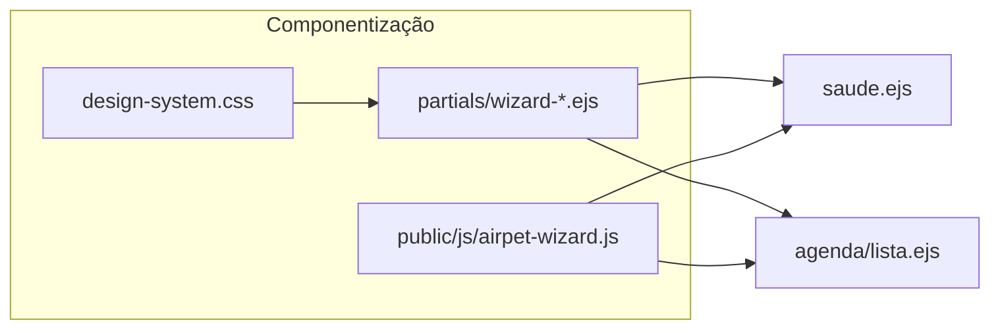

# Plano: Formulários Wizard + CRO (TAG/Planos)

## Diagnóstico do código atual

| Área | Arquivo principal | Situação |
|------|-------------------|----------|
| Cadastro de pet | [`src/views/pets/cadastro.ejs`](src/views/pets/cadastro.ejs) | Já é wizard (9 passos, barra de progresso, um foco por tela, voltar/avançar). **Referência de padrão.** |
| Registro de conta | [`src/views/auth/registro.ejs`](src/views/auth/registro.ejs) | Wizard em 2 etapas + badges + validação (força de senha, match, máscara telefone). |
| Saúde (vacina/registro) | [`src/views/pets/saude.ejs`](src/views/pets/saude.ejs) | **Modais com formulário longo numa única tela** — principal alvo de refactor wizard. |
| Agendar serviço | [`src/views/agenda/lista.ejs`](src/views/agenda/lista.ejs) | Formulário GET com 4 campos + data + lista de horários — fluxo guiado possível sem mudar backend (só UX). |
| Parceiros | [`src/views/parceiros/cadastro.ejs`](src/views/parceiros/cadastro.ejs) | Blocos numerados; pode virar wizard com os mesmos `name` e `action`. |
| Compra TAG | [`src/views/tags/loja-tag.ejs`](src/views/tags/loja-tag.ejs), [`src/views/tags/planos.ejs`](src/views/tags/planos.ejs) | Já são funil de conversão; podem receber **passos visuais** e prova social. |

**Conversão TAG/planos no código:** variáveis como `planoAtivo` aparecem em fluxos NFC (ex.: [`src/views/nfc/intermediaria.ejs`](src/views/nfc/intermediaria.ejs)). Os formulários de saúde **não recebem** hoje contexto de plano — será preciso passar do controller (ex.: `res.locals` ou props do partial) para personalizar gatilhos de upgrade.

---

## 1. Experiência wizard (padrão único)

**Princípios (alinhados ao que já existe em `cadastro.ejs`):**

- **Um objetivo por passo** (ex.: só nome da vacina; só datas; só local).
- **Barra de progresso** textual + percentual (`Passo 2 de 4` + trilha).
- **Navegação:** primário “Continuar”, secundário “Voltar”, terciário “Pular” quando o campo for opcional.
- **Submissão:** um único `<form method="POST">` com campos `hidden` ou seções ocultas; avançar só preenche estado no DOM e valida o passo atual (evita múltiplos POSTs e mantém os validators do Express em [`src/middlewares/writeRouteValidators.js`](src/middlewares/writeRouteValidators.js) sem mudança obrigatória).

**Estrutura de etapas sugerida — Vacina (modal ou bottom-sheet):**

1. **O quê** — `nome_vacina` (com chips rápidos: V10, Antirrábica, V8, etc., preenchendo o input).
2. **Quando** — `data_aplicacao` (obrigatório); mensagem curta de reforço (“Ajuda a manter a carteira em dia”).
3. **Próxima dose** — `data_proxima` opcional + **sugestão inteligente** (ex.: +1 ano a partir da aplicação, editável) para reduzir esforço.
4. **Onde** — `veterinario` + `clinica` (opcionais, um passo só).
5. **Revisão** — `observacoes` + resumo + botão “Salvar” (microcopy: “Registrar na carteira”).

**Registro de saúde (modal):**

1. Tipo (`tipo`) com cards grandes (já há emojis no `<select>` — elevar para botões).
2. Data (`data_registro`).
3. Detalhes (`descricao`, `veterinario`, `clinica`, `observacoes` conforme validator).

**Agenda (`lista.ejs`):** transformar o GET em assistente: passo 1 petshop → 2 serviço filtrado → 3 pet → 4 dia → 5 horários (mantendo query string ou estado em JS que monta o GET ao final). Isso melhora mobile sem exigir nova rota.

---

## 2. UX e usabilidade

- **Labels** em frase natural onde fizer sentido (“Quando foi aplicada?” vs só “Data”).
- **Validação em tempo real** por passo: bloquear “Continuar” até válido; mensagens inline próximas ao campo.
- **Datas:** `input type="date"` + texto de ajuda; validar `data_proxima >= data_aplicacao` no cliente antes do POST.
- **Acessibilidade:** `aria-current="step"`, foco no primeiro campo ao mudar de passo, botões com área mínima ~44px (já alinhado ao mobile-first do [plano existente](.cursor/plans/redesign_mobile_first_airpet_66662cad.plan.md)).

---

## 3. UI moderna (mobile-first)

- Reutilizar tokens de [`src/public/css/design-system.css`](src/public/css/design-system.css) e classes `air-*` / `ds-*` já usadas em registro e saúde.
- **Modal** de vacina: considerar **bottom sheet** em viewport pequena (mesmo conteúdo wizard, animação slide-up) para “cara de app”.
- Cards para opções (tipo de registro, vacinas frequentes), espaçamento generoso, CTA fixo na base do modal.

---

## 4. Psicologia e microcopy (exemplos prontos)

| Momento | Microcopy sugerido |
|---------|-------------------|
| Abrir vacina | “Vamos registrar em poucos toques.” |
| Após nome | “Ótimo — agora a data oficial da aplicação.” |
| Opcional próxima dose | “Se quiser, a gente lembra você antes.” (ligar verbalmente ao benefício premium depois) |
| Quase fim | “Só mais um passo — confira e salve.” |
| Sucesso (toast/flash) | “Vacina salva — a carteira do(a) [nome] está mais completa.” |

Tom: celebrar progresso (**efeito de progresso endividado**), sem infantilizar.

---

## 5. Integração com marketing e CRO (TAG/planos)

**Regra:** upgrade **contextual e escaneável**, nunca bloquear o fluxo obrigatório.

- **Faixa ou card colapsável** no passo 3 (próxima dose) ou na tela de revisão: *“Com o plano premium da TAG, você pode receber lembretes e [benefício real do produto — alinhar texto ao `features_json` em [`tags/planos.ejs`](src/views/tags/planos.ejs)].”* CTA secundário: “Ver planos” → `/tags/planos` ou `/tags/loja-tag`.
- **Empty states** da carteira de saúde: já há mensagens neutras; acrescentar uma linha de valor + link suave (“Quem tem TAG premium centraliza tudo em um lugar”).
- **Após primeiro registro** (sessão ou flag client-side): mini celebração + **momento ideal** para “Garantir lembretes” (upgrade), com dismiss.
- **Hierarquia:** benefício primeiro, preço depois; evitar pop-up intersticial no meio do wizard.

**Backend:** em [`saudeController`](src/controllers/saudeController.js) (ou middleware de view), injetar `planoAtivo`, `planoSlug` quando existir, para **não** mostrar upsell redundante a quem já é premium.

---

## 6. Engenharia: componentização

**Novos artefatos sugeridos (nomes ilustrativos):**

- [`src/views/partials/wizard-shell.ejs`](src/views/partials/wizard-shell.ejs) — props: `id`, `totalSteps`, título, slot de steps.
- [`src/views/partials/wizard-progress.ejs`](src/views/partials/wizard-progress.ejs) — barra + “Passo X de Y”.
- [`src/public/js/airpet-wizard.js`](src/public/js/airpet-wizard.js) — classe ou factory: `next()`, `prev()`, `validateStep()`, `syncHiddenFields()`, eventos para analytics (opcional).
- Refatorar **CSS** dos modais de [`saude.ejs`](src/views/pets/saude.ejs): mover estilos grandes do `extraHead` para `design-system.css` ou partial de feature (menos inline, melhor cache).

**Separação de responsabilidades:**

- EJS: marcação e cópias default.
- JS: máquina de estados do wizard + validação cliente.
- Servidor: validação final inalterada (express-validator já cobre vacina/registro).

**Performance:** um bundle pequeno por página ou wizard genérico carregado uma vez; evitar duplicar o IIFE longo como em `registro.ejs` — extrair para o módulo compartilhado.

---

## 7. Priorização de entrega

1. **Alta:** Wizard para modais de **vacina** e **registro** em `saude.ejs` + gatilhos de valor TAG/plano + passagem de `locals` do plano.
2. **Média:** Wizard **agenda** (GET) e harmonização visual com `wizard-shell`.
3. **Média/baixa:** `parceiros/cadastro.ejs`, `loja-tag` (passos visuais), `pets/editar.ejs` (seção a seção).

---

## 8. Métricas sugeridas (para validar depois da implementação)

- Taxa de conclusão do modal vacina (abriu → POST com sucesso).
- Tempo médio no fluxo.
- Cliques em “Ver planos” / conversões a partir dos novos pontos (se houver analytics).
