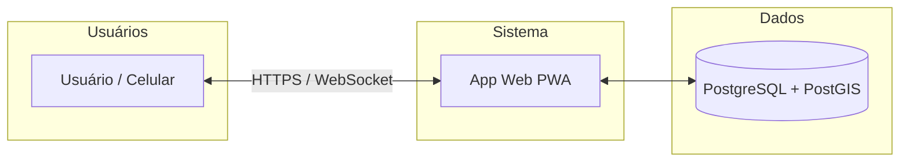

# AIRPET — Visão Geral do Produto

**Sistema de identificação e recuperação de pets via NFC (PWA)** — para tutores, quem encontra pets perdidos e administradores.

---

## 1. Título e resumo

O **AIRPET** é uma plataforma web progressiva (PWA) que permite identificar e recuperar pets perdidos por meio de tags NFC na coleira, além de oferecer rede social de pets, carteira de saúde digital, mapa interativo e chat moderado. Destina-se a tutores de animais, a qualquer pessoa que encontre um pet (com ou sem cadastro) e a administradores do sistema.

---

## 2. Problema e solução

**Problema:** Pets se perdem com frequência; sem identificação rápida, o reencontro com o dono é difícil e demorado.

**Solução:** Cada pet recebe uma **tag NFC** na coleira. Se o pet se perder, qualquer pessoa pode **escanear a tag com o celular** e ver na hora a foto do pet, o nome do dono e opções de **contato**. O sistema **registra a localização** de cada scan (rastro de avistamentos) e envia **alertas automáticos** a usuários próximos. Há ainda **chat moderado** para comunicação segura entre quem encontrou e o dono, **mapa** com pets perdidos e avistamentos, e **escalamento automático** do raio de alerta com o tempo.

---

## 3. Funcionalidades

### Para o tutor (usuário cadastrado)

| Funcionalidade | Descrição |
|---------------|-----------|
| Cadastro de pets | Wizard em etapas: tipo, raça, aparência, foto e descrição emocional |
| Perfil do pet | Idade (humana), peso ideal por raça, calendário de cuidados |
| Carteira de saúde | Vacinas, consultas e exames com lembretes automáticos (ex.: 7 dias antes) |
| Diário do pet | Registro diário com fotos (alimentação, passeio, humor, peso, etc.) |
| Tags NFC | Ativar tag, vincular ao pet e ser notificado quando alguém escaneia |
| Pet perdido | Reportar desaparecimento com mapa e escalamento automático por proximidade |
| Feed social | Publicar fotos, curtir, comentar, repostar e seguir outros usuários |
| Perfil público | Página pública com posts, pets e seguidores |
| Mapa interativo | Petshops, clínicas, abrigos, pets perdidos e avistamentos em tempo real |
| Chat moderado | Conversar com quem encontrou o pet (mensagens moderadas) |
| Agendamentos | Agendar banho, tosa e consulta em petshops parceiros |
| Notificações | Alertas in-app, push no celular e em tempo real |
| PWA | Instalar no celular como aplicativo |

### Para quem encontrou o pet (com ou sem cadastro)

| Funcionalidade | Descrição |
|---------------|-----------|
| Scan NFC | Escanear a tag na coleira e ver dados do pet e do dono |
| Contatar o dono | Ligar ou enviar mensagem por formulário |
| Enviar localização | GPS enviado automaticamente ao dono |
| Enviar foto | Enviar foto do pet encontrado ao dono |
| Chat | Conversar com o dono via chat moderado |

### Para o administrador

| Funcionalidade | Descrição |
|---------------|-----------|
| Dashboard | Métricas em tempo real (usuários, pets, alertas, tags, petshops) |
| Gerenciar usuários | Listar, promover a admin ou rebaixar |
| Gerenciar pets | Visualizar todos os pets cadastrados |
| Gerenciar petshops | CRUD de petshops parceiros |
| Pets perdidos | Aprovar, rejeitar e escalar alertas manualmente |
| Moderação do chat | Aprovar ou rejeitar mensagens antes de chegarem ao destinatário |
| Tags NFC | Gerar lotes, reservar para usuários, enviar, bloquear |
| Pontos no mapa | Adicionar/editar clínicas, abrigos, ONGs, parques |
| Configurações | Raios de alerta e regras de escalamento automático |

---

## 4. Stack tecnológica

| Categoria | Tecnologias |
|-----------|-------------|
| Backend | Node.js, Express |
| Banco de dados | PostgreSQL, PostGIS (consultas geográficas) |
| Frontend | EJS (templates), Tailwind CSS |
| Tempo real | Socket.IO |
| Mapas | Leaflet, OpenStreetMap |
| Autenticação | Sessão (cookie), JWT |
| Segurança | Helmet, rate limit, validação de entrada |
| Upload e mídia | Multer |
| Notificações push | Web Push API |
| PWA | Service Worker, manifest, cache offline |

---

## 5. Arquitetura (alto nível)

Aplicação web em estilo **MVC**: camada de serviços entre controllers e modelos, sessão persistida em PostgreSQL, comunicação em tempo real via WebSockets (chat, notificações, painel admin), jobs em background (lembretes de vacina, escalamento de alertas) e PWA com suporte offline. O front é renderizado no servidor (EJS) e enriquecido com JavaScript no cliente (mapas, chat, notificações).

---

## 6. Domínio — entidades

Lista apenas dos **nomes** das entidades do sistema (sem estrutura de campos ou relacionamentos):

- Usuario  
- Pet  
- NfcTag  
- TagScan  
- TagBatch  
- Localizacao  
- Publicacao  
- Curtida  
- Comentario  
- Repost  
- Seguidor  
- SeguidorPet  
- Notificacao  
- PushSubscription  
- Conversa  
- MensagemChat  
- PetPerdido  
- PontoMapa  
- Petshop  
- AgendaPetshop  
- ConfigSistema  
- DiarioPet  
- RegistroSaude  
- Vacina  
- FotoPerfilPet  

---

## 7. Diferenciais e casos de uso

- **Escalamento automático de alertas** — o raio de busca de pets perdidos aumenta com o tempo para alcançar mais pessoas.
- **Mapa com PostGIS** — consultas geográficas eficientes para proximidade, avistamentos e pontos de interesse.
- **Chat moderado** — mensagens entre quem encontrou e o dono passam por aprovação do administrador.
- **Feed social de pets** — publicações, curtidas, comentários, reposts e seguidores.
- **Carteira de saúde com lembretes** — vacinas e eventos com notificações automáticas (ex.: 7 dias antes).
- **Painel admin completo** — dashboard, usuários, pets, petshops, pets perdidos, moderação de chat, tags NFC, pontos no mapa e configurações do sistema.
- **PWA** — instalação como app e uso offline onde aplicável.
- **Auditoria de scans** — cada leitura da tag registra localização e contexto para rastreio e segurança.

---

## 8. O que está incluso na aquisição

- **Código-fonte completo** do projeto.  
- **Documentação técnica** (ex.: manual em DOCUMENTACAO.md) para instalação, configuração e desenvolvimento.  
- **Schema do banco de dados** entregue no momento da entrega (estrutura de tabelas para recriar o banco).  
- **Sem credenciais ou chaves** — o comprador configura seu próprio ambiente. Será necessário configurar variáveis de ambiente tais como: credenciais de banco (ex.: host, porta, usuário, senha), segredo de sessão/JWT, opcionais para e-mail, push e outros serviços que o comprador queira integrar.

---

## 9. Contato e próximos passos

*[Inserir aqui: e-mail, telefone ou canal preferido para contato.]*

*[Opcional: indicação de reunião de apresentação, NDA ou processo de due diligence.]*

---

*Documento de visão geral para apresentação do produto. Não substitui a documentação técnica nem o código-fonte, entregues após o fechamento do negócio.*
