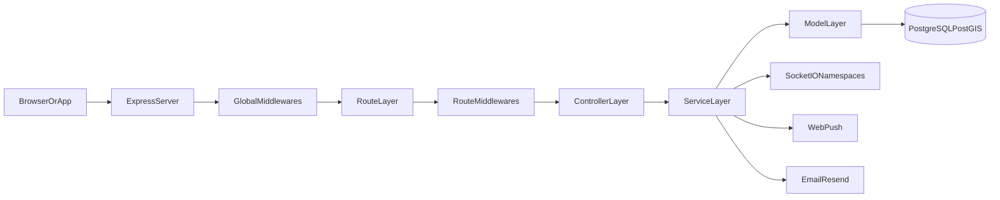
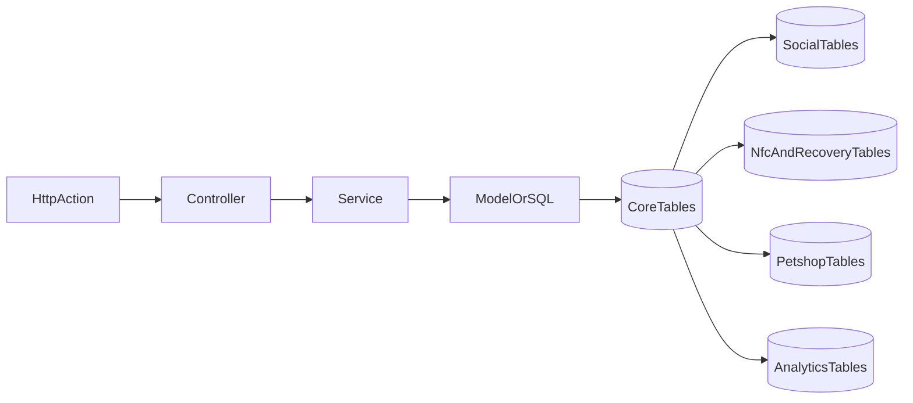
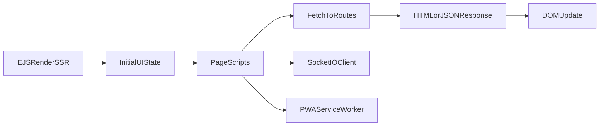
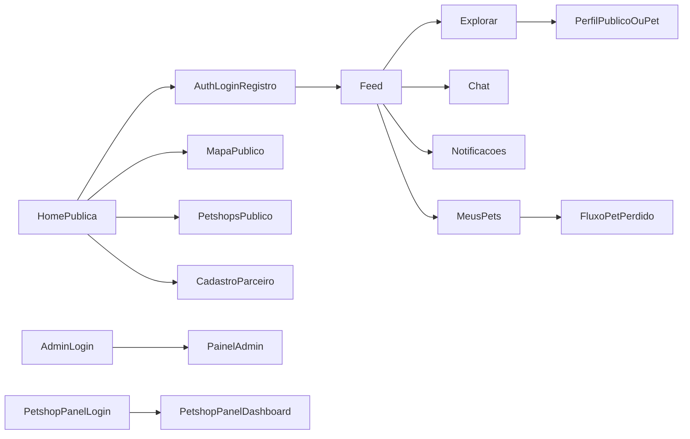

# SYSTEM OVERVIEW - AIRPET

## 1. Objetivo deste documento

Este documento e a referencia tecnica unica do projeto `AIRPET`, pensado para:

- onboarding de engenharia e analise de sistemas;
- leitura por IA (inclusive NotebookLM) com contexto completo;
- rastreabilidade ponta a ponta entre pagina, rota, controller, service/model e banco.

Escopo coberto: repositorio inteiro (frontend, backend, banco, rotas, views, realtime, PWA, admin e painel parceiro).

---

## 2. Resumo executivo do sistema

O `AIRPET` e uma plataforma web para identificacao, protecao e recuperacao de pets, com foco em:

- **NFC e recuperacao**: tags NFC, fluxo de "encontrei", envio de localizacao/foto e comunicacao com tutor;
- **Rede social pet**: feed, curtidas, comentarios, reposts, seguidores de usuarios e pets;
- **Geointeligencia**: mapa com petshops, pontos de interesse, avistamentos, pets perdidos e leituras de tag;
- **Operacao profissional**: painel de parceiros (petshops), agendamentos e vinculo petshop-pet;
- **Backoffice**: painel admin com moderacao, analytics, mapa, aparencia PWA, configuracoes e notificacoes.

---

## 3. Stack e tecnologias por camada

## 3.1 Backend

- Runtime: `Node.js`
- Framework HTTP: `Express 5`
- View engine SSR: `EJS`
- Realtime: `Socket.IO` (namespaces `/chat`, `/admin`, `/notificacoes`)
- Sessao: `express-session` + `connect-pg-simple`
- Auth: sessao + fallback JWT (`jsonwebtoken`)
- Seguranca e hardening: `helmet`, `cookie-parser`, rate-limit
- Uploads: `multer`
- Validacao: `express-validator`
- Emails: `resend`
- Push: `web-push`

Arquivo de entrada: `server.js`.

## 3.2 Banco de dados

- SGBD: `PostgreSQL`
- Extensao geoespacial: `PostGIS`
- Driver: `pg`
- Estilo de acesso: SQL manual (sem ORM)
- Migracoes: arquivo unico incremental/idempotente em `src/config/migrate.js`

## 3.3 Frontend

- Renderizacao: SSR em `EJS` + JS vanilla por pagina
- CSS: Tailwind (`input.css` -> `output.css`) + `design-system.css` + `theme-override.css`
- PWA: `manifest.json` dinamico, `sw.js`, instalacao guiada (Android/iOS), push subscription
- Mapa: Leaflet + MarkerCluster

---

## 4. Arquitetura global

## 4.1 Fluxo do backend

## 4.2 Fluxo do banco de dados

## 4.3 Fluxo do frontend

## 4.4 Fluxo de paginas

---

## 5. Estrutura de pastas (visao funcional)

- `server.js`: bootstrap, middlewares globais, rotas, erros, socket, scheduler.
- `src/routes`: definicao de endpoints e composicao por dominio.
- `src/controllers`: regras HTTP (render, redirect, JSON).
- `src/services`: regras de negocio e orquestracao.
- `src/models`: acesso SQL ao PostgreSQL.
- `src/config`: banco, sessao e migracoes.
- `src/sockets`: realtime para chat/admin/notificacoes.
- `src/views`: paginas EJS e partials.
- `src/public/js`: scripts de cliente (app, pwa, mapa, chat, etc.).
- `src/public/css`: design system, tema e output do Tailwind.

---

## 6. Catalogo completo de views e paginas

## 6.1 Layouts e partials compartilhados

- `src/views/layouts/main.ejs`: casca principal (header/flash/conteudo/footer).
- `src/views/partials/header.ejs`: head HTML, links CSS e metadados.
- `src/views/partials/nav.ejs`: nav desktop/mobile, dropdown de perfil, tabs de navegacao.
- `src/views/partials/footer.ejs`: rodape + scripts globais + socket cliente para badge de notificacao.
- `src/views/partials/flash.ejs`: mensagens de feedback de sessao.
- `src/views/partials/erro.ejs`: erro 404/500.
- `src/views/partials/modal-crop.ejs`: modal de recorte de imagem.
- `src/views/partials/page-header.ejs`: bloco padrao de cabecalho interno.
- `src/views/partials/petshop-calendar-card.ejs`: card reutilizavel de agenda petshop.
- `src/views/partials/admin-layout.ejs` e `src/views/partials/admin-footer.ejs`: shell do admin.

## 6.2 Paginas institucionais/publicas

- `src/views/home.ejs`: landing principal (`GET /`), estatisticas e CTA para login/registro/parceiros.
- `src/views/termos.ejs`: termos de uso (`GET /termos`).
- `src/views/privacidade.ejs`: politica de privacidade (`GET /privacidade`).
- `src/views/parceiros/cadastro.ejs`: onboarding publico de petshop (`GET /parceiros/cadastro`).
- `src/views/parceiros/sucesso.ejs`: confirmacao de solicitacao de parceria.

## 6.3 Autenticacao

- `src/views/auth/login.ejs`: login (`/auth/login`).
- `src/views/auth/registro.ejs`: cadastro (`/auth/registro`).
- `src/views/auth/esqueci-senha.ejs`: solicitacao de reset.
- `src/views/auth/redefinir-senha.ejs`: redefinicao por token.
- `src/views/auth/limite-usuarios.ejs`: mensagem de limite/controle de usuarios.

## 6.4 Feed e exploracao social

- `src/views/feed.ejs`: feed de seguidos, interacoes sociais e publicacao.
- `src/views/explorar.ejs`: descoberta de perfis/pets/conteudo.
- `src/views/explorar/busca.ejs`: busca de usuarios e pets.
- `src/views/explorar/perfil.ejs`: perfil publico de tutor.
- `src/views/explorar/perfil-pet.ejs`: perfil publico de pet.

## 6.5 Perfil do usuario e pets

- `src/views/perfil.ejs`: perfil privado (dados pessoais, endereco, fotos, configuracoes).
- `src/views/pets/meus-pets.ejs`: lista dos pets do tutor.
- `src/views/pets/cadastro.ejs`: cadastro de pet.
- `src/views/pets/confirmacao.ejs`: confirmacao de acao/cadastro.
- `src/views/pets/perfil.ejs`: detalhes de pet.
- `src/views/pets/editar.ejs`: edicao de pet.
- `src/views/pets/saude.ejs`: carteira de saude.
- `src/views/pets/vincular-tag.ejs`: associacao de tag NFC ao pet.

## 6.6 Fluxo de pet perdido

- `src/views/pets-perdidos/formulario.ejs`: reportar desaparecimento.
- `src/views/pets-perdidos/encontrado.ejs`: marcar como encontrado.
- `src/views/pets-perdidos/confirmacao.ejs`: confirmacao de fluxo.

## 6.7 NFC/Tags (publico e autenticado)

- `src/views/nfc/minhas-tags.ejs`: tags do usuario.
- `src/views/nfc/ativar.ejs`: ativacao de tag.
- `src/views/nfc/escolher-pet.ejs`: associar pet na ativacao.
- `src/views/nfc/nao-ativada.ejs`: estado de tag ainda inativa.
- `src/views/nfc/intermediaria.ejs`: estado intermediario de scan.
- `src/views/nfc/encontrei.ejs`: formulario publico "encontrei este pet".
- `src/views/nfc/enviar-foto.ejs`: envio de foto no fluxo de encontro.
- `src/views/nfc/encontrei-sucesso.ejs`: confirmacao publica do fluxo.

## 6.8 Mapa, petshops e pontos

- `src/views/mapa/index.ejs`: mapa com filtros e camadas.
- `src/views/petshops/lista.ejs`: listagem de petshops.
- `src/views/petshops/mapa.ejs`: mapa de petshops.
- `src/views/petshops/detalhes.ejs`: perfil detalhado do petshop.
- `src/views/pontos/detalhes.ejs`: detalhes de ponto de mapa.

## 6.9 Notificacoes e chat

- `src/views/notificacoes/lista.ejs`: caixa de notificacoes.
- `src/views/chat/lista.ejs`: lista de conversas.
- `src/views/chat/conversa.ejs`: chat de conversa.

## 6.10 Agenda

- `src/views/agenda/lista.ejs`: agenda de servicos e compromissos.

## 6.11 Painel parceiro (petshop)

- `src/views/petshop-panel/login.ejs`: login de conta parceira.
- `src/views/petshop-panel/dashboard.ejs`: dashboard operacional do parceiro.

## 6.12 Painel administrativo

- `src/views/admin/login.ejs`
- `src/views/admin/dashboard.ejs`
- `src/views/admin/analytics.ejs`
- `src/views/admin/boosts.ejs`
- `src/views/admin/usuarios.ejs`
- `src/views/admin/pets.ejs`
- `src/views/admin/petshops.ejs`
- `src/views/admin/petshops-solicitacoes.ejs`
- `src/views/admin/pets-perdidos.ejs`
- `src/views/admin/moderacao.ejs`
- `src/views/admin/configuracoes.ejs`
- `src/views/admin/aparencia.ejs`
- `src/views/admin/enviar-notificacao.ejs`
- `src/views/admin/gerenciar-mapa.ejs`
- `src/views/admin/mapa.ejs`
- `src/views/admin/tags.ejs`
- `src/views/admin/lotes.ejs`
- `src/views/admin/lote-detalhes.ejs`
- `src/views/admin/gerar-tags.ejs`

---

## 7. Backend em profundidade

## 7.1 Entrada e ciclo de inicializacao

1. Carrega `.env`.
2. Sobe Express + HTTP server + Socket.IO.
3. Aplica middlewares globais.
4. Configura EJS e `res.locals`.
5. Exponibiliza `manifest.json` dinamico.
6. Monta rotas principais (`app.use('/', routes)`).
7. Configura static files.
8. Configura handlers de erro.
9. Compartilha sessao com Socket.IO.
10. Executa `runMigrations()`.
11. Inicia scheduler (`schedulerService.iniciar()`).
12. Sobe servidor na porta definida.

## 7.2 Camadas e responsabilidades

- **Routes (`src/routes`)**: mapeamento URL -> middleware -> controller.
- **Middlewares (`src/middlewares`)**:
  - autenticacao (`estaAutenticado`, `estaAutenticadoAPI`);
  - autorizacao (`apenasAdmin`, petshop owner/approval);
  - rate limit;
  - upload.
- **Controllers (`src/controllers`)**:
  - recebem req/res;
  - validam fluxo HTTP;
  - renderizam view ou retornam JSON.
- **Services (`src/services`)**:
  - regra de negocio complexa;
  - integracoes externas (push/email/geocoding);
  - jobs agendados.
- **Models (`src/models`)**:
  - SQL parametrizado;
  - leitura/escrita no PostgreSQL.

## 7.3 Dominio por rotas principais

- Auth: `/auth/*`
- Feed/Explorar: `/feed`, `/explorar/*`
- Perfil: `/perfil`, `/perfil/galeria/*`
- Pets: `/pets/*`
- Perdidos: `/perdidos/*`
- NFC publico: `/tag/*` e `/t/*`
- Tags autenticadas: `/tags/*`
- Mapa: `/mapa/*` e `/api/localizacao/*`
- Petshops publicos: `/petshops/*`
- Parceiros publicos: `/parceiros/*`
- Chat: `/chat/*`
- Notificacoes: `/notificacoes/*`
- Admin: `${ADMIN_PATH}/*` (padrao `/admin`)
- Painel parceiro: `/petshop-panel/*`

## 7.4 Realtime

- Namespace `/chat`: mensageria de conversa.
- Namespace `/admin`: moderacao/sinais de operacao.
- Namespace `/notificacoes`: push de badge/eventos de notificacao.

---

## 8. Banco de dados em profundidade

## 8.1 Principios

- Banco unico PostgreSQL com PostGIS.
- Sessao persistida em tabela (`user_sessions`).
- Migrations idempotentes via `CREATE TABLE IF NOT EXISTS` e `ALTER TABLE ... IF NOT EXISTS`.
- SQL manual sem ORM.

## 8.2 Contextos de dados (agrupamento)

- **Auth/Conta**: `usuarios`, `user_sessions`, colunas de perfil e controle.
- **Pet core**: `pets`, `racas`, `fotos_perfil_pet`.
- **NFC e recuperacao**: `nfc_tags`, `tag_batches`, `tag_scans`, `pets_perdidos`, `localizacoes`.
- **Social**: `publicacoes`, `curtidas`, `comentarios`, `reposts`, `seguidores`, `seguidores_pets`, `post_*`.
- **Comunicacao**: `conversas`, `mensagens_chat`, `notificacoes`, `push_subscriptions`.
- **Petshop ecossistema**: `petshops`, `petshop_accounts`, `petshop_profiles`, `petshop_posts`, `petshop_products`, `petshop_*`.
- **Saude e agenda**: `vacinas`, `registros_saude`, `agenda_petshop`, `petshop_appointments`.
- **Mapa**: `pontos_mapa`, dados geo em varias tabelas com indice GIST.
- **Analytics/recomendacao**: `post_interactions_raw`, `profile_visits_raw`, `user_interest_profile`, `post_engagement_agg`, `manual_boosts`, etc.

## 8.3 Fluxo CRUD padrao

`Route -> Controller -> Service/Model -> SQL(pg) -> PostgreSQL -> resposta JSON/HTML`

## 8.4 Pontos transacionais

Ha uso de `BEGIN/COMMIT/ROLLBACK` em fluxos especificos (ex.: vinculos petshop e lote/tag), mas o sistema tambem possui fluxos multi-etapa sem transacao global, exigindo atencao em casos de falha parcial.

---

## 9. Frontend em profundidade

## 9.1 Base visual e design system

Arquivo principal: `src/public/css/design-system.css`.

Padroes:

- Tokens CSS no `:root` (`--accent`, `--ink`, `--text`, etc.).
- Componentes base: `card`, `btn-primary`, `btn-ghost`, `input-field`.
- Ajustes de tema admin e shells de navegacao.
- Animacoes utilitarias e respeito a `prefers-reduced-motion`.

## 9.2 Estrategia de pagina

- SSR inicial em EJS para dados primarios.
- JS por pagina para interacao e fetch incremental.
- Scripts globais:
  - `app.js` (menu, flash, geolocalizacao helper, method override client-side);
  - `pwa.js` (SW, install prompt, push subscribe);
  - `permissions.js` (fluxo de permissoes).

## 9.3 PWA

- SW: `src/public/sw.js`
- Cache shell com `CACHE_VERSION`.
- Estrategias:
  - assets: cache-first;
  - HTML: network-first com fallback offline;
  - requests nao-GET: sem cache;
  - exclusao de area admin/petshop sensivel no SW.
- Push:
  - subscription enviada para `/notificacoes/push/subscribe`;
  - notificacao abre link definido pelo payload.

## 9.4 Mapa frontend

`src/public/js/mapa.js` implementa:

- Leaflet + marker cluster;
- carregamento por bounding box (`/mapa/api/pins`);
- filtros por camada (`petshops`, `perdidos`, `avistamentos`, `pontos`, `pet_scans`);
- popup contextual por tipo de ponto.

---

## 10. Fluxos ponta a ponta (negocio)

## 10.1 Login e sessao

1. Usuario submete `/auth/login`.
2. Controller autentica via `authService`.
3. Sessao gravada em `user_sessions` e cookie JWT de apoio.
4. Rotas protegidas passam por `estaAutenticado`.

## 10.2 Feed social

1. Usuario acessa `/feed` ou `/explorar`.
2. Controller monta feed SSR inicial.
3. Interacoes (curtir/comentar/repost) chamam `/explorar/post/*`.
4. Atualizacao de contadores e notificacoes no banco + frontend.

## 10.3 Pet perdido

1. Tutor abre `/perdidos/:pet_id/formulario`.
2. Registro vai para `pets_perdidos`.
3. Fluxo admin aprova/rejeita/escalona.
4. Notificacoes e mapa recebem atualizacao.

## 10.4 Fluxo NFC publico

1. Leitura tag abre `/tag/:tag_code`.
2. Backend decide tela conforme status (`nao-ativada`, `ativar`, `intermediaria`, etc.).
3. Encontrador envia localizacao/foto.
4. Sistema registra scan/localizacao e aciona notificacoes.

## 10.5 Chat moderado

1. Conversa aberta em `/chat/:conversaId`.
2. Mensagem registrada.
3. Moderacao/admin valida quando aplicavel.
4. Entrega em tempo real por namespace de socket.

## 10.6 Ecossistema petshop

1. Solicitacao publica por `/parceiros/cadastro`.
2. Admin aprova/rejeita.
3. Conta parceira usa `/petshop-panel`.
4. Parceiro gerencia perfil, posts, servicos, agenda e vinculos.

---

## 11. Matriz de rastreabilidade (pagina -> backend -> dados -> assets)

| Pagina/View | Rota principal | Controller | Services/Models chave | Dados principais | JS/CSS |
|---|---|---|---|---|---|
| `home.ejs` | `GET /` | handler em `routes/index.js` | query direta + models auxiliares | `pets`, `usuarios`, `pontos_mapa`, `pets_perdidos` | `app.js`, `pwa.js`, `design-system.css` |
| `auth/login.ejs` | `/auth/login` | `authController.mostrarLogin/login` | `authService`, `Usuario` | `usuarios`, `user_sessions` | globais |
| `feed.ejs` | `GET /feed` | `explorarController.feedSeguidos` | `recomendacaoService`, `Publicacao`, `Curtida`, `Comentario` | `publicacoes`, `curtidas`, `comentarios`, `reposts`, `post_stats` | scripts do feed + globais |
| `explorar.ejs` | `GET /explorar` | `explorarController.feed` | `Publicacao`, `Seguidor`, `PetshopPublication` | social + petshop posts | globais |
| `explorar/busca.ejs` | `GET /explorar/busca` | `explorarController.paginaBusca` | busca em modelos sociais | `usuarios`, `pets` | globais |
| `explorar/perfil.ejs` | `GET /explorar/perfil/:id` | `explorarController.perfilPublico` | `Usuario`, `Seguidor`, `Publicacao` | social + perfil | globais |
| `explorar/perfil-pet.ejs` | `GET /explorar/pet/:id` | `explorarController.perfilPet` | `Pet`, `SeguidorPet`, `Publicacao` | `pets`, `seguidores_pets`, social | globais |
| `perfil.ejs` | `GET/PUT /perfil` | `perfilController` | `Usuario`, uploads, geocoding | `usuarios`, `fotos_perfil_pet` | `crop-modal.js`, globais |
| `pets/meus-pets.ejs` | `GET /pets` | `petController.listar` | `Pet` | `pets`, `nfc_tags` (relacao) | globais |
| `pets/cadastro.ejs` | `GET/POST /pets/cadastro` | `petController.criar` | `Pet`, validadores | `pets`, `racas` | globais |
| `pets/perfil.ejs` | `GET /pets/:id` | `petController.mostrarPerfil` | `Pet`, `PetPerdido` | `pets`, `pets_perdidos` | globais |
| `pets/editar.ejs` | `GET/POST/PUT /pets/:id/editar` | `petController.atualizar` | `Pet` | `pets` | globais |
| `pets/saude.ejs` | `GET /pets/:id/saude` | `petController.mostrarSaude` | `saudeService`, `Vacina`, `RegistroSaude` | `vacinas`, `registros_saude` | globais |
| `pets/vincular-tag.ejs` | `GET/POST /pets/:id/vincular-tag` | `petController.vincularTag` | `tagService`, `NfcTag` | `nfc_tags`, `pets` | globais |
| `pets-perdidos/formulario.ejs` | `GET/POST /perdidos/:pet_id/*` | `petPerdidoController` | `PetPerdido`, notificacao | `pets_perdidos`, `notificacoes` | globais |
| `nfc/*` | `/tag/*` e `/tags/*` | `nfcController`, `tagController` | `nfcService`, `tagService`, `NfcTag`, `TagScan` | `nfc_tags`, `tag_scans`, `localizacoes` | globais |
| `mapa/index.ejs` | `GET /mapa`, `GET /mapa/api/pins` | `mapaController` | `mapaService`, `PontoMapa`, `Petshop`, `PetPerdido` | tabelas geoespaciais | `mapa.js`, Leaflet CSS/JS |
| `petshops/lista.ejs` | `GET /petshops` | `petshopController.listar` | `Petshop`, `PetshopFollower` | `petshops`, `petshop_followers` | globais |
| `petshops/detalhes.ejs` | `GET /petshops/:id` | `petshopController.mostrarDetalhes` | `Petshop* models` | ecossistema petshop | `petshop-calendar.js`, globais |
| `notificacoes/lista.ejs` | `GET /notificacoes` | `notificacaoController.listar` | `notificacaoService`, `Notificacao` | `notificacoes`, `push_subscriptions` | socket client no footer |
| `chat/lista.ejs` | `GET /chat` | `chatController.listarConversas` | `chatService`, `Conversa`, `MensagemChat` | `conversas`, `mensagens_chat` | `chat.js` |
| `chat/conversa.ejs` | `GET /chat/:conversaId` | `chatController.mostrarConversa` | `chatService` | chat tables | `chat.js` + socket |
| `agenda/lista.ejs` | `GET /agenda` | `agendaController.listar` | `AgendaPetshop` | `agenda_petshop` | globais |
| `parceiros/cadastro.ejs` | `GET/POST /parceiros/cadastro` | `publicPartnerController` | `petshopOnboardingService`, `PetshopPartnerRequest` | `petshop_partner_requests` | `wizard.js`, globais |
| `petshop-panel/login.ejs` | `/petshop-panel/auth/login` | `petshopPanelController.login` | `PetshopAccount` | `petshop_accounts` | globais |
| `petshop-panel/dashboard.ejs` | `/petshop-panel/dashboard` | `petshopPanelController.dashboard` | servicos petshop diversos | agenda, posts, produtos, vinculos | scripts do painel |
| `admin/*.ejs` | `${ADMIN_PATH}/*` | `adminController` + `pontoMapaController` | `adminAnalyticsService`, moderacao, models admin | multiplas tabelas | `admin-moderacao.js`, Chart.js |

---

## 12. Endpoints importantes por modulo (resumo)

## 12.1 Auth

- `GET /auth/login`
- `POST /auth/login`
- `GET /auth/registro`
- `POST /auth/registro`
- `GET/POST /auth/esqueci-senha`
- `GET/POST /auth/redefinir-senha/:token`
- `GET /auth/logout`

## 12.2 Explorar/Feed

- `GET /explorar`
- `POST /explorar/post`
- `POST /explorar/api/v2/posts`
- `GET /explorar/api/v2/feed`
- `POST /explorar/post/:id/curtir`
- `DELETE /explorar/post/:id/curtir`
- `POST /explorar/post/:id/comentar`
- `POST /explorar/post/:id/repost`
- `GET /explorar/perfil/:id`
- `GET /explorar/pet/:id`

## 12.3 Pets/NFC/Perdidos

- `GET/POST /pets/cadastro`
- `GET /pets/:id`
- `PUT /pets/:id`
- `GET/POST /pets/:id/vincular-tag`
- `GET /tag/:tag_code`
- `POST /tag/:tag_code/localizacao`
- `GET/POST /perdidos/:pet_id/reportar`

## 12.4 Mapa/Petshops

- `GET /mapa`
- `GET /mapa/api/pins`
- `GET /petshops`
- `GET /petshops/mapa`
- `GET /petshops/:id`
- `POST /petshops/:id/seguir`
- `POST /petshops/:id/avaliar`

## 12.5 Notificacoes/Chat

- `GET /notificacoes`
- `GET /notificacoes/api/count`
- `POST /notificacoes/marcar-todas-lidas`
- `POST /notificacoes/push/subscribe`
- `GET /chat`
- `POST /chat/iniciar`
- `GET /chat/:conversaId`
- `POST /chat/:conversaId/enviar`

## 12.6 Admin/Painel parceiro

- Admin (prefixo `${ADMIN_PATH}`):
  - `/login`, `/analytics`, `/moderacao`, `/gerenciar-mapa`, `/aparencia`, etc.
- Parceiro (`/petshop-panel`):
  - `/auth/login`, `/dashboard`, `/perfil`, `/servicos`, `/agenda`, `/posts`, `/vinculos/solicitacoes/*`.

---

## 13. Fluxo de navegacao de paginas (visao textual)

- Visitante: `home` -> `login/registro` -> acesso autenticado.
- Usuario autenticado:
  - `feed` <-> `explorar` <-> `busca`;
  - `explorar` -> `perfil publico` / `perfil pet`;
  - `feed` -> `chat` / `notificacoes`;
  - `perfil` -> `meus pets` -> `perfil pet` -> `saude` / `vincular tag`;
  - `perfil pet` -> fluxo `pet perdido`.
- Fluxo NFC publico:
  - `/tag/:tag_code` -> estados de tag -> envio de localizacao/foto -> confirmacao.
- Operacao administrativa:
  - login admin -> dashboard -> moderacao/analytics/gestao de entidades.
- Operacao parceira:
  - login parceiro -> dashboard -> agenda/posts/servicos/vinculos.

---

## 14. Integracoes externas

- OpenStreetMap/Nominatim (geocoding e mapa).
- IBGE (dados regionais para filtros/localizacao, quando aplicavel).
- Resend (email transacional).
- Web Push (notificacoes PWA).

---

## 15. Riscos e pontos de atencao arquitetural

- Migracoes em arquivo unico sem versionamento formal por revisao.
- Mistura de SQL em models e alguns pontos fora deles (controllers/services).
- Alto acoplamento de alguns fluxos sociais e petshop no mesmo banco sem isolacao por schema.
- Dependencia significativa de PostGIS para funcionalidades core de mapa/localizacao.

---

## 16. Glossario rapido

- **SSR**: renderizacao no servidor (EJS).
- **PWA**: web app instalavel com service worker e push.
- **PostGIS**: extensao geoespacial do PostgreSQL.
- **Namespace Socket.IO**: canal logico isolado para realtime.
- **SWR-like cache**: estrategia de cache com revalidacao no cliente.

---

## 17. Como usar este documento no NotebookLM/IA

Sequencia recomendada de leitura:

1. Secoes 2 a 4 (visao geral e diagramas).
2. Secoes 6 e 11 (catalogo de views + matriz de rastreabilidade).
3. Secoes 7 e 8 (backend e banco em profundidade).
4. Secao 10 (fluxos de negocio).

Para perguntas de IA, prefira prompts do tipo:

- "Explique o fluxo completo de `<modulo>` com base no SYSTEM_OVERVIEW_AIRPET.md".
- "Mapeie onde a view `<x>` toca backend e banco".
- "Liste riscos tecnicos do fluxo `<y>` e pontos de melhoria".

---

## 18. Inventario tecnico de arquivos-chave

- Entrada: `server.js`
- Rotas: `src/routes/*.js`
- Controllers: `src/controllers/*.js`
- Services: `src/services/*.js`
- Models: `src/models/*.js`
- DB config/migration: `src/config/database.js`, `src/config/session.js`, `src/config/migrate.js`
- Sockets: `src/sockets/*.js`
- Views: `src/views/**/*.ejs`
- Frontend JS: `src/public/js/*.js`
- Frontend CSS: `src/public/css/*.css`

Documento gerado para centralizar entendimento do sistema inteiro em um unico ponto de consulta.
