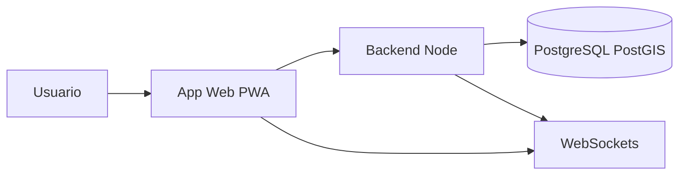

# AIRPET — Visão Geral do Produto

**Documento de visão geral para apresentação comercial.**  
Sistema de identificação e recuperação de pets via NFC, entregue como PWA, com mapa, feed social, saúde digital e painel administrativo.

---

## 1. Resumo

O **AIRPET** é uma plataforma web (PWA) voltada a **tutores de pets** e à **recuperação de animais perdidos** por meio de tags NFC na coleira. Qualquer pessoa que encontre o pet pode escanear a tag com o celular, ver dados do animal e do tutor e acionar o contato, enquanto o sistema registra localizações e dispara alertas para usuários próximos. Além disso, oferece rede social de pets, carteira de saúde digital, diário, mapa interativo, chat moderado e agendamentos em petshops.

---

## 2. Problema e Solução

**Problema:** Pets se perdem; quem encontra nem sempre sabe como devolver ao dono, e o tutor não tem como ser acionado rapidamente.

**Solução AIRPET:**

- Cada pet recebe uma **tag NFC** na coleira.
- Em caso de perda, qualquer pessoa **encosta o celular na tag** e abre uma página com **foto do pet**, **dados do tutor** e **opções de contato** (ligar, enviar mensagem).
- O sistema **registra a localização GPS** de cada scan, formando um rastro de avistamentos.
- **Usuários próximos** ao último avistamento recebem **alertas automáticos** (push e in-app).
- O tutor pode **conversar com quem encontrou** por chat moderado e acompanhar o pet no mapa.

O produto vai além da tag: inclui feed social, saúde, diário, mapa, agenda e painel administrativo para gestão completa da plataforma.

---

## 3. Funcionalidades

### Para o tutor (usuário cadastrado)

| Funcionalidade | Descrição |
|----------------|-----------|
| Cadastro de pets | Wizard em múltiplos passos: tipo, raça, aparência, foto e descrição |
| Perfil do pet | Idade (humana), peso ideal por raça, calendário de cuidados |
| Carteira de saúde | Vacinas, consultas e exames com lembretes automáticos |
| Diário do pet | Registro diário com fotos (alimentação, passeio, humor, peso) |
| Tags NFC | Ativar tag, vincular ao pet, notificação quando alguém escaneia |
| Pet perdido | Reportar desaparecimento com mapa e escalamento automático por proximidade |
| Feed social | Publicar fotos, curtir, comentar, repostar e seguir outros usuários |
| Perfil público | Página pública com posts, pets e seguidores |
| Mapa interativo | Petshops, clínicas, abrigos, pets perdidos e avistamentos em tempo real |
| Chat moderado | Conversa com quem encontrou o pet (mensagens moderadas) |
| Agendamentos | Agendar serviços em petshops parceiros |
| Notificações | Alertas in-app, push no celular e em tempo real |
| PWA | Instalação no celular como aplicativo |

### Para quem encontrou um pet (sem necessidade de cadastro)

| Funcionalidade | Descrição |
|----------------|-----------|
| Scan NFC | Escanear a tag na coleira e ver dados do pet e do dono |
| Contatar o dono | Ligar ou enviar mensagem por formulário |
| Enviar localização | Envio automático de GPS ao dono |
| Enviar foto | Enviar foto do pet encontrado ao dono |
| Chat | Conversar com o dono via chat moderado |

### Para o administrador

| Funcionalidade | Descrição |
|----------------|-----------|
| Dashboard | Métricas em tempo real (usuários, pets, alertas, tags, petshops) |
| Gerenciar usuários | Listar, promover ou rebaixar usuários |
| Gerenciar pets | Visualizar todos os pets cadastrados |
| Gerenciar petshops | CRUD de petshops parceiros |
| Pets perdidos | Aprovar, rejeitar e escalar alertas manualmente |
| Moderação do chat | Aprovar ou rejeitar mensagens antes de chegarem ao destinatário |
| Tags NFC | Gerar lotes, reservar, enviar e bloquear tags |
| Pontos no mapa | Adicionar e editar clínicas, abrigos, ONGs, parques |
| Configurações | Raios de alerta e parâmetros de escalamento automático |

---

## 4. Stack tecnológica

| Categoria | Tecnologia |
|-----------|------------|
| Backend | Node.js, Express |
| Banco de dados | PostgreSQL com extensão PostGIS (consultas geográficas) |
| Sessão e autenticação | Sessão em banco, JWT (cookie httpOnly), hash seguro de senhas |
| Frontend / templates | EJS (renderização no servidor) |
| Estilos | TailwindCSS |
| Tempo real | Socket.IO (chat, notificações, admin) |
| Upload | Multer (fotos de pets, diário, chat, posts) |
| Push | Web Push API |
| Mapas | Leaflet, MarkerCluster, OpenStreetMap |
| PWA | Service Worker, manifest, cache offline |
| Segurança | Helmet, rate limit, validação de formulários |

---

## 5. Arquitetura (alto nível)

Aplicação web em arquitetura **MVC com camada de serviços**: rotas delegam a controllers, que utilizam services para regras de negócio e models para acesso a dados. Sessão armazenada em PostgreSQL; notificações e chat em tempo real via WebSockets; jobs em background para lembretes, alertas e limpeza. Frontend servido com EJS e assets estáticos; suporte a PWA para uso como app no celular.

---

## 6. Domínio / entidades

O sistema trabalha com as seguintes entidades de domínio (lista apenas nominativa):

- Usuario  
- Pet  
- NfcTag, TagBatch, TagScan  
- Localizacao  
- PetPerdido  
- Publicacao, Comentario, Curtida, Repost  
- Seguidor, SeguidorPet  
- Conversa, MensagemChat  
- Notificacao, PushSubscription  
- RegistroSaude, Vacina  
- DiarioPet  
- AgendaPetshop  
- Petshop  
- PontoMapa  
- FotoPerfilPet  
- ConfigSistema  

*(Estrutura detalhada de tabelas e relacionamentos é entregue junto ao código-fonte e documentação técnica após a aquisição.)*

---

## 7. Diferenciais e casos de uso

- **Escalamento automático de alertas:** raio de busca de pets perdidos amplia com o tempo para alcançar mais pessoas.
- **Mapa com PostGIS:** consultas geográficas eficientes para pins (petshops, clínicas, abrigos, avistamentos, pets perdidos).
- **Chat moderado:** mensagens entre quem encontrou e o dono passam por aprovação, aumentando segurança.
- **Feed social de pets:** publicações, curtidas, comentários, reposts e seguidores.
- **Carteira de saúde com lembretes:** vacinas e eventos com notificações automáticas (ex.: 7 dias antes).
- **Painel administrativo completo:** dashboard, usuários, pets, petshops, pets perdidos, moderação, tags NFC, pontos no mapa e configurações globais.
- **PWA:** instalação no celular, uso offline básico e notificações push.

---

## 8. O que está incluso na aquisição

- **Código-fonte completo** do projeto (backend, frontend, assets, configurações).
- **Documentação técnica** (arquitetura, estrutura, uso interno) entregue após formalização.
- **Schema do banco de dados** (estrutura de tabelas e migrations) na entrega, para o comprador configurar seu próprio ambiente.
- **Sem inclusão de credenciais ou chaves:** todas as variáveis de ambiente (banco, JWT, sessão, Web Push, etc.) devem ser configuradas pelo comprador. Uma lista dos *nomes* das variáveis necessárias pode ser fornecida para facilitar o deploy.

*(Detalhes de entrega, suporte e garantias devem ser definidos em contrato ou acordo entre as partes.)*

---

## 9. Contato e próximos passos

*[Preencher com seu e-mail, telefone ou canal de contato.]*

*[Opcional: indicação de NDA ou reunião de apresentação antes do compartilhamento de documentação técnica e código.]*

---

*Este documento é material de visão geral para apresentação comercial. O código-fonte e a documentação técnica detalhada são entregues somente após acordo entre as partes.*
