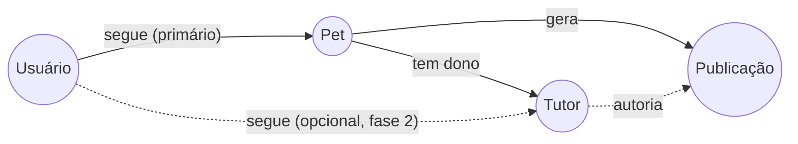

# 02 — Grafo "seguir pet"

> Fase A — fundação viral. O nó central do grafo deixa de ser usuário e passa a ser pet.

## 1. Problema e oportunidade

A feature "seguir pet" é **rara no mercado** e é o diferencial que justifica AIRPET existir como rede social separada. Hoje o backend tem dois grafos:

- `seguidores` — usuário → usuário (clássico).
- `seguidores_pets` — usuário → pet (já criado e funcional).

A oportunidade é **promover `seguidores_pets` ao grafo primário** da experiência: feed "Para você", notificações, sugestões e share gravitam em torno de pets, não de humanos.

## 2. O que já existe (refs)

| Capacidade | Onde |
|------------|------|
| Tabela `seguidores_pets` | [`migrationBaselineStatements.js`](../../src/config/migrationBaselineStatements.js) (linhas 1155–1165) |
| API de model completa (seguir, deixar, listar, contar) | [`src/models/SeguidorPet.js`](../../src/models/SeguidorPet.js) |
| Tabela `seguidores` usuário→usuário | [`migrationBaselineStatements.js`](../../src/config/migrationBaselineStatements.js) (linhas 898–907) |
| Sinal de interesse | `user_interest_profile` (espécie/raça com score) |
| Engajamento | `post_interactions_raw` (likes, comments, view, watch_ms) |
| Feed atual | `feedSeguidos` em [`src/controllers/explorarController.js`](../../src/controllers/explorarController.js) |

## 3. Spec funcional

### 3.1. Hierarquia de grafos

Regras:

- **Padrão**: a ação "Seguir" disponível em qualquer card de pet é seguir o **pet**.
- **Seguir tutor** é uma ação **secundária**, oculta no menu de overflow do tutor (3 pontos). Útil para: ver tutor que tem múltiplos pets, mensagens diretas, posts do tutor sem pet vinculado.
- **Migração**: não remover a tabela `seguidores`. Em UI, despromover follow de humano: deixar de exibir contadores de seguidores humanos no header de perfil de tutor; manter só em "configurações > minhas conexões".

### 3.2. Feed "Para você" (home logada em `/feed`)

Composição do feed (ordem de prioridade no ranking):

1. **Posts de pets que sigo** — base obrigatória.
2. **Posts de pets sugeridos** quando o usuário segue < 5 pets (cold start): top pets por cidade + espécie de interesse (usar `user_interest_profile` + `feed_candidate_pool`).
3. **Repost por amigos** — quando alguém que sigo (tutor) repostou.
4. **Desafio ativo da semana** — 1 card editorial no topo, descartável.

**Nunca** intercalar `petshop_posts` no feed Pets (ver [spec 03](./03-separacao-feeds.md)).

### 3.3. Notificações geradas pelo follow

| Evento | Destinatário | Mensagem |
|--------|--------------|----------|
| Pet que sigo postou | Eu | "<nome do pet> publicou: <legenda truncada>" |
| Pet começou a me seguir | Tutor | "<nome do pet seguidor> está seguindo <meu pet>" |
| Pet atingiu marco (100, 1k, 10k seguidores) | Tutor | "Parabéns! <nome do pet> chegou a <N> seguidores" |
| Pet seguido marcado como perdido | Eu | "<nome> está perdido perto de <bairro>" (alta prioridade) |

Persistir em `notificacoes` (já tem `pet_id`, `remetente_id`, `publicacao_id`).

### 3.4. Endpoints sugeridos (API JSON, REST)

| Verbo | Path | Descrição |
|-------|------|-----------|
| `POST` | `/api/pets/:id/seguir` | `SeguidorPet.seguir(uid, petId)` |
| `DELETE` | `/api/pets/:id/seguir` | `SeguidorPet.deixarDeSeguir(uid, petId)` |
| `GET` | `/api/pets/:id/seguidores?limit=50` | `SeguidorPet.listarSeguidores` |
| `GET` | `/api/usuarios/me/pets-seguidos` | `SeguidorPet.listarPetsSeguidos` |
| `GET` | `/api/feed?cursor=...` | Feed de pets seguidos com ranking |

### 3.5. Cold start (onboarding)

- Após criar conta: tela "Conheça pets perto de você" com 6–12 pets recomendados (cidade + espécie favorita escolhida no onboarding).
- Forçar follow de **no mínimo 3 pets** antes de liberar o feed final. Sem essa fricção o feed nasce vazio.

### 3.6. Sugestões "Quem seguir" (em runtime)

Engine simples, ordenada por:

1. Mesma cidade do usuário.
2. Mesma espécie já seguida.
3. Tutor é seguido por alguém que sigo (segundo grau).
4. Pet com alta velocidade de seguidores nos últimos 7 dias.

Reaproveitar `user_relationship_strength` (humano→humano) e `feed_candidate_pool` (segmento) já existentes.

## 4. Métricas de sucesso

- **D1 retention** após onboarding: meta +15% vs baseline (estado atual sem follow-pet pet-first).
- **Pets seguidos por usuário em D7**: meta ≥ 6 (acima disso, feed sozinho sustenta retorno).
- **% de notificações de "pet que sigo postou" abertas**: meta ≥ 25%.

## 5. Riscos e anti-padrões

- **Manter contador de seguidores humano no header em paralelo com o do pet.** Confunde. Decisão: header de tutor mostra "N pets" e "N seguidores **dos meus pets** somados"; o conceito "meus seguidores humanos" só aparece em configurações.
- **Permitir follow em massa via bots.** Aplicar rate limit em `POST /api/pets/:id/seguir` (ex.: 60/hora/usuário) e desafio captcha após picos.
- **Notificar excessivamente.** Limitar "pet que sigo postou" a no máximo 1 push agregado por pet a cada 6h ("3 novos posts de <pet>").
- **Cold start vazio.** Não liberar feed sem ao menos 3 follows; senão o usuário abre e abandona.

## 6. Entrega faseada

| Sprint | Entrega | Critério de pronto |
|--------|---------|--------------------|
| 1 | Endpoints REST `seguir/desseguir` + UI no card e no perfil do pet | Toggle visível em todo lugar onde aparece pet |
| 1 | Notificação "pet que sigo postou" (in-app + push) | Throttle de 6h por pet ativo |
| 2 | Feed `/feed` reordenado para priorizar pets seguidos | A/B vs `feedSeguidos` atual |
| 2 | Onboarding "siga 3 pets" obrigatório | Não libera home sem 3 follows |
| 3 | Sugestões "Quem seguir" no feed e em perfil vazio | CTR ≥ 10% |
| 4 | Despromoção visual de `seguidores` humano | Contador escondido do header de tutor |
