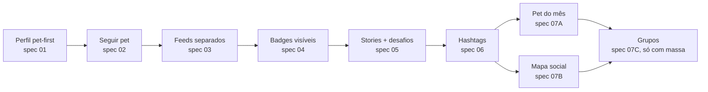

# 07 — Pet do mês, mapa social e grupos

> Fases C e D — prestígio e comunidade. Três features encadeadas com pesos de risco crescentes; **grupos é o último** porque exige tooling de moderação maduro.

## 1. Problema e oportunidade

Depois que o usuário tem hábito (stories + desafios) e descobre pets novos (hashtags + mapa), o próximo passo de engajamento é **status** e **pertencimento**:

- **Pet do mês** — pulso mensal de prestígio com share externo viral.
- **Mapa social** — sensação local ("pets do meu bairro"), descoberta orgânica.
- **Grupos** — comunidade pesada por raça/cidade (estilo Facebook), só quando há massa.

## 2. O que já existe (refs)

| Capacidade | Onde |
|------------|------|
| PostGIS + geo em usuários, petshops, pets perdidos | [`migrationBaselineStatements.js`](../../src/config/migrationBaselineStatements.js) (extensão PostGIS, `idx_usuarios_ultima_loc`, `idx_petshops_loc`) |
| Coordenadas de interação | `post_interactions_raw.geo_point` |
| Cidade do usuário | `usuarios.cidade`, `usuarios.bairro` (linhas 1080–1095) |
| Mapa atual (pets perdidos) | [`src/routes/mapaRoutes.js`](../../src/routes/mapaRoutes.js), [`src/controllers/mapaController.js`](../../src/controllers/mapaController.js) |
| Pet score | `post_score_snapshot`, `post_engagement_agg` |
| Notificação push | `push_subscriptions` |

---

# Parte A — Pet do Mês

## A.1. Spec funcional

### A.1.1. Modelo de dados

```sql
CREATE TABLE pet_do_mes_edicoes (
  id SERIAL PRIMARY KEY,
  mes DATE NOT NULL UNIQUE,                          -- '2026-05-01' representa maio
  cidade_slug VARCHAR(80),                            -- NULL = nacional
  estado VARCHAR(20) NOT NULL DEFAULT 'aberta',      -- aberta | encerrada
  inicia_em TIMESTAMP NOT NULL,
  termina_em TIMESTAMP NOT NULL,
  vencedor_pet_id INTEGER REFERENCES pets(id),
  capa_url TEXT
);

CREATE TABLE pet_do_mes_indicacoes (
  id BIGSERIAL PRIMARY KEY,
  edicao_id INTEGER NOT NULL REFERENCES pet_do_mes_edicoes(id) ON DELETE CASCADE,
  pet_id INTEGER NOT NULL REFERENCES pets(id) ON DELETE CASCADE,
  indicado_por INTEGER REFERENCES usuarios(id) ON DELETE SET NULL,
  curado_admin BOOLEAN NOT NULL DEFAULT false,
  criado_em TIMESTAMP DEFAULT NOW(),
  UNIQUE (edicao_id, pet_id)
);

CREATE TABLE pet_do_mes_votos (
  id BIGSERIAL PRIMARY KEY,
  edicao_id INTEGER NOT NULL REFERENCES pet_do_mes_edicoes(id) ON DELETE CASCADE,
  pet_id INTEGER NOT NULL REFERENCES pets(id) ON DELETE CASCADE,
  user_id INTEGER NOT NULL REFERENCES usuarios(id) ON DELETE CASCADE,
  device_fingerprint VARCHAR(80),
  ip_hash VARCHAR(64),
  criado_em TIMESTAMP DEFAULT NOW(),
  UNIQUE (edicao_id, user_id)
);

CREATE INDEX idx_pet_do_mes_votos_pet ON pet_do_mes_votos (edicao_id, pet_id);
```

### A.1.2. Fluxo

1. **Indicação (semana 1 e 2)**: qualquer usuário indica até 3 pets que segue. Admin pode curar até 8 finalistas adicionais.
2. **Finalistas (semana 3, segunda-feira)**: top 12 por número de indicações **únicas por usuário** + curados admin. Aparece em `/pet-do-mes`.
3. **Votação (semana 3 e 4)**: 1 voto por usuário por edição. Voto não é revogável. Tela mostra finalistas em grid randomizado por sessão.
4. **Encerramento (último dia do mês 23:59)**: vencedor recebe badge `pet_do_mes` com `contexto='YYYY-MM'`, tela "Vencedor de <mês>" gerada e compartilhável.

### A.1.3. Anti-fraude

- **Identidade obrigatória**: voto exige login (`user_id` não-nulo).
- **Limite por dispositivo**: `device_fingerprint` único na edição (impede múltiplas contas no mesmo dispositivo).
- **Limite por IP**: `ip_hash` registrado; um IP pode produzir no máximo 5 votos na edição (rede família ok, rede de empresa também; bot farm bloqueado).
- **Conta nova**: contas criadas após início da edição não votam nessa edição.
- **Detecção de surto**: se um pet recebe >20% dos votos em 1h vindos de IPs novos, congelar e revisar.
- **Auditoria pública**: tela final mostra "X votos válidos, Y descartados".

### A.1.4. Versões por cidade

- Primeira execução: nacional.
- Quando uma cidade tem ≥ 200 pets ativos com 5+ posts em 30d, abrir edição local concorrente (`cidade_slug`). Não competir entre cidades.

## A.2. Métricas de sucesso

- **% DAU que vota**: meta 30%+ na primeira semana de votação.
- **Shares externos do card do vencedor**: meta ≥ 1000 por edição nacional.
- **Indicações por usuário**: meta ≥ 1.5.

## A.3. Riscos

- **Fraude não controlada destrói legitimidade.** Anti-fraude desde o MVP — não é "fase 2".
- **Vencedor genérico premiado.** Manter curadoria editorial entre os finalistas (até 8 por admin).
- **Prêmio material no início.** Atrai farm. Começar com badge + visibilidade; prêmio físico só com parceria patrocinada e claramente comunicada.

---

# Parte B — Mapa social

## B.1. Spec funcional

### B.1.1. Modelo de dados

Reaproveitar `post_interactions_raw.geo_point` quando o usuário consentir compartilhar local. Adicionar tabela própria para **check-ins** explícitos (mais ricos que view de feed):

```sql
CREATE TABLE pet_checkins (
  id BIGSERIAL PRIMARY KEY,
  pet_id INTEGER NOT NULL REFERENCES pets(id) ON DELETE CASCADE,
  autor_user_id INTEGER NOT NULL REFERENCES usuarios(id) ON DELETE CASCADE,
  publicacao_id INTEGER REFERENCES publicacoes(id) ON DELETE SET NULL,
  story_id BIGINT REFERENCES stories(id) ON DELETE SET NULL,
  geo_point GEOGRAPHY(POINT, 4326) NOT NULL,
  precisao VARCHAR(20) NOT NULL DEFAULT 'bairro',    -- 'exato' | 'bairro' | 'cidade'
  local_nome VARCHAR(150),                           -- "Parque da Cidade"
  criado_em TIMESTAMP DEFAULT NOW()
);

CREATE INDEX idx_pet_checkins_geo ON pet_checkins USING GIST (geo_point);
CREATE INDEX idx_pet_checkins_pet ON pet_checkins (pet_id, criado_em DESC);
```

### B.1.2. UX

Tela `/mapa-social`:

- Mapa centrado na cidade do usuário.
- Camadas (toggle individual):
  - **Pets vistos** (pins com foto pequena, agrupados em clusters).
  - **Pets perdidos** (já existe, manter cor vermelha distintiva).
  - **Petshops parceiros** (camada desligada por padrão na primeira sessão — ver [spec 03](./03-separacao-feeds.md)).
  - **Desafio da semana** (pins de posts participantes, ativo só durante a semana).

Tocar pin abre mini-card: foto, nome, "ver perfil".

### B.1.3. Privacidade

- **Padrão**: precisão `bairro` (raio ~500m com jitter aleatório por pin para não revelar endereço).
- **Opt-in explícito** para precisão `exato` (campo `precisao = 'exato'`) — ativável por post.
- **Opt-out**: configuração "não aparecer no mapa". Pets perdidos sempre aparecem com `precisao='exato'` por necessidade — usuário aceita ao marcar como perdido.
- Pet privado nunca aparece no mapa público.

### B.1.4. Anti-stalking

- Histórico de check-ins de um pet **não é mostrado em uma timeline na ordem**. Só "última visto há X dias" no perfil.
- Rate limit em `/api/mapa-social/proximos` para evitar varredura sistemática.
- Botão "denunciar este pin" disponível.

## B.2. Métricas

- **% DAU que abre mapa social**: meta 15%.
- **Pets ativos no mapa por cidade-alvo**: meta ≥ 50 (limite mínimo para ser interessante).

## B.3. Riscos

- **Localização exata pública por padrão.** Sério risco LGPD + segurança. Sempre `bairro` como padrão.
- **Mapa visual confuso** quando há muitos pins. Clusterização obrigatória.
- **Camada comercial dominante.** Petshops parceiros começam OFF; usuário liga se quiser.

---

# Parte C — Grupos

## C.1. Critérios de entrada (não MVP)

Grupos **só** entram em produção quando todos os critérios estiverem satisfeitos:

| Critério | Limiar | Justificativa |
|----------|--------|---------------|
| Volume de DAU | ≥ 5.000 | Sem massa, grupos morrem na semana 2 |
| Sistema de denúncia em produção | Pronto | Inevitável precisar moderar |
| Política de TOS pública e clara | Publicada | Proteção legal |
| Time/operação de moderação | Pelo menos 1 pessoa dedicada part-time | Resposta < 24h |
| Ferramenta de banimento e mute por grupo | Pronta | Admin de grupo precisa autonomia |
| Métrica de qualidade no feed principal | Saudável (≥ 60% NPS "rede social") | Senão grupos canibalizam |

## C.2. Spec funcional (preview, para validar quando entrar em scope)

### C.2.1. Modelo

```sql
CREATE TABLE grupos (
  id SERIAL PRIMARY KEY,
  slug VARCHAR(80) UNIQUE NOT NULL,
  nome VARCHAR(120) NOT NULL,
  descricao TEXT,
  tipo VARCHAR(20) NOT NULL,                          -- 'raca' | 'cidade' | 'tema'
  raca_alvo VARCHAR(100),
  cidade_alvo VARCHAR(100),
  tema VARCHAR(80),
  privacidade VARCHAR(20) NOT NULL DEFAULT 'aberto', -- 'aberto' | 'fechado'
  capa_url TEXT,
  criado_por INTEGER REFERENCES usuarios(id),
  membros_count INTEGER NOT NULL DEFAULT 0,
  data_criacao TIMESTAMP DEFAULT NOW()
);

CREATE TABLE grupo_membros (
  grupo_id INTEGER NOT NULL REFERENCES grupos(id) ON DELETE CASCADE,
  user_id INTEGER NOT NULL REFERENCES usuarios(id) ON DELETE CASCADE,
  papel VARCHAR(20) NOT NULL DEFAULT 'membro',       -- 'admin' | 'moderador' | 'membro'
  entrou_em TIMESTAMP NOT NULL DEFAULT NOW(),
  PRIMARY KEY (grupo_id, user_id)
);

CREATE TABLE grupo_posts (
  id BIGSERIAL PRIMARY KEY,
  grupo_id INTEGER NOT NULL REFERENCES grupos(id) ON DELETE CASCADE,
  publicacao_id INTEGER NOT NULL REFERENCES publicacoes(id) ON DELETE CASCADE,
  fixado BOOLEAN NOT NULL DEFAULT false,
  criado_em TIMESTAMP NOT NULL DEFAULT NOW(),
  UNIQUE (grupo_id, publicacao_id)
);
```

Observação: grupo "envelopa" `publicacoes` — não cria nova tabela de post. Garante que conteúdo de grupo aparece no perfil do pet normalmente.

### C.2.2. UX (preview)

- Aba "Grupos" só aparece em produto após release. Não vai na bottom bar — vive em "Explorar > Grupos".
- Página de grupo: feed próprio, regras visíveis, lista de membros, botão "entrar/sair".
- Composer: quando dentro de um grupo, opção "publicar também aqui" (post entra em `publicacoes` e em `grupo_posts`).

### C.2.3. Moderação

- Admin do grupo (criador) pode promover moderadores.
- Moderador pode: ocultar post, banir membro do grupo (não global), fixar regras.
- Denúncia escala para admin AIRPET.
- Banimento global e shadow-ban são prerrogativa AIRPET, não de admin de grupo.

## C.3. Sucesso e risco

Não definir métricas detalhadas até atingir critérios de entrada. Risco principal: **lançar cedo** e descobrir que moderar 200 grupos tóxicos sem time é insustentável (precedente Reddit/Facebook).

---

## Visão integrada (encadeamento)



Cada caixa entrega valor isolado, mas o ganho composto justifica a ordem.
