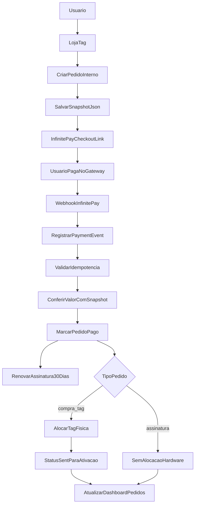
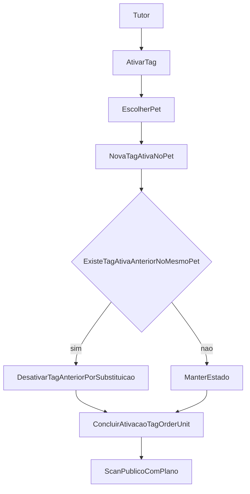

# TAG NFC Paga - Documentação Completa da Implementação

## 1) Visão Geral

Este documento descreve o que foi implementado para o produto de TAG NFC paga no AIRPET:

- compra da tag física (hardware) e assinatura de 30 dias;
- renovação com regra de saldo (`max(valid_until, now) + 30 dias`);
- personalização por unidade (pet + foto);
- dashboard de pedidos;
- integração com checkout/webhook InfinitePay;
- antifraude (idempotência, validações server-side, snapshot de preço);
- substituição em cadeia por pet (nova tag ativa desativa a anterior do mesmo pet);
- indicador de plano na tela pública de scan.

## 2) Arquivos Principais

### Banco e migração

- `migrations/1774920000000_tag_saas_commerce_subscription.mjs`

### Configuração comercial

- `src/config/planos.js`

### Models novos

- `src/models/PlanDefinition.js`
- `src/models/TagProductOrder.js`
- `src/models/TagOrderUnit.js`
- `src/models/TagSubscription.js`
- `src/models/PromoCode.js`
- `src/models/Referral.js`
- `src/models/PaymentEvent.js`

### Serviços novos

- `src/services/infinitePayService.js`
- `src/services/tagCommerceService.js`
- `src/services/tagEntitlementService.js`

### Controllers/Rotas novos e alterados

- `src/controllers/tagCommerceController.js`
- `src/routes/tagRoutes.js`
- `src/controllers/tagController.js` (substituição de tag na ativação)
- `src/services/nfcService.js` (selo plano ativo/inativo)
- `src/controllers/nfcController.js`

### Views novas e alteradas

- `src/views/tags/loja-tag.ejs`
- `src/views/tags/planos.ejs`
- `src/views/tags/pedidos-lista.ejs`
- `src/views/tags/pedido-detalhe.ejs`
- `src/views/nfc/intermediaria.ejs`
- `src/views/partials/nav.ejs`
- `src/views/home.ejs`
- `src/views/pets/perfil.ejs`

### Documentação de gateway

- `.cursor/plans/INFINITYPAY.MD`

## 3) Modelo de Cobrança e Regras de Negócio

1. **Tag física**: compra única por unidade.
2. **Assinatura**: recorrência de 30 dias para recursos premium.
3. **Renovação**: `valid_until_novo = max(valid_until_atual, now) + 30 dias`.
4. **Grace period**: padrão de 72h (`TAG_SUBSCRIPTION_GRACE_HOURS`).
5. **Vínculo obrigatório na compra**: cada unidade do pedido de tag deve ter `pet_id` do dono.
6. **Limite comercial**: máximo de 10 pets por usuário no fluxo pago.
7. **Substituição por pet**: ao ativar nova tag para um pet, desativa a tag ativa anterior daquele mesmo `pet_id`.

## 4) Banco de Dados (Tabelas)

### `plan_definitions`

Define catálogo de planos (`basico`, `plus`, `familia`) e `features_json`.

### `tag_subscriptions`

Controle de assinatura por usuário:

- `plan_slug`
- `valid_until`
- `grace_until`
- `last_transaction_nsu`

### `tag_product_orders`

Pedido comercial:

- tipo (`order_type`): `compra_tag` ou `assinatura_recorrente` (e combo, quando aplicado);
- valores em centavos;
- referência de checkout (`infinitepay_order_nsu`, `checkout_url`);
- `snapshot_json` (congelamento de regra/valor).

### `tag_order_units`

Unidades de tag dentro do pedido:

- `sequencia`
- `pet_id` (obrigatório na prática de negócio)
- `nfc_tag_id`
- `print_photo_url`
- `personalization_status`

### Antifraude e promoções

- `payment_events`
- `promo_codes`
- `promo_code_redemptions`
- `referrals`
- `referral_credits`

### Evolução de `nfc_tags`

Novos campos:

- `substituida_por_tag_id`
- `desativada_em`
- `motivo_desativacao`
- `display_photo_url`

## 5) Fluxo de Pagamento (Mermaid)

## 6) Fluxo de Ativação e Substituição (Mermaid)

## 7) Rotas Implementadas

Em `src/routes/tagRoutes.js`:

- `GET /tags/loja-tag`
- `GET /tags/planos`
- `POST /tags/pedidos`
- `GET /tags/pedidos`
- `GET /tags/pedidos/:id`
- `POST /tags/pedidos/:id/unidades/:unitId/personalizar`
- `POST /tags/pagamentos/webhook/infinitepay`
- `GET /tags/pagamentos/retorno`
- `GET /tags/premium/estado`

Rotas legadas de ativação continuam:

- `GET /tags/:tag_code/ativar`
- `POST /tags/:tag_code/ativar`
- `GET /tags/:tag_code/escolher-pet`
- `POST /tags/:tag_code/vincular-pet`

## 8) Como Funciona Cada Camada

### `tagCommerceController`

Orquestra entrada/saída HTTP:

- monta payload de pedido;
- chama serviço de criação de pedido/checkout;
- renderiza lista/detalhe;
- processa personalização de unidade;
- recebe webhook.

### `tagCommerceService`

Regra de negócio:

- valida carrinho e pets do usuário;
- aplica cupom e indicação;
- calcula subtotal/desconto/total;
- cria pedido + unidades;
- cria checkout link;
- processa webhook:
  - log de evento,
  - idempotência,
  - marca pedido pago,
  - renova assinatura,
  - aloca tags físicas quando necessário.

### `tagEntitlementService`

Estado do plano:

- resolve `planoAtivo`, `emGrace`, `validUntil`, `planSlug`;
- middleware `requirePlanoAtivo`.

### `infinitePayService`

Cliente de integração:

- gera `order_nsu`;
- chama endpoint de checkout;
- suporta fallback mock em ambiente sem token.

## 9) Indicador de Plano no Scan Público

No `nfcService`:

- consulta assinatura do dono do pet;
- retorna flags para view:
  - `planoAtivo`
  - `planoEmGrace`
  - `planoExpiraEm`
  - `planoSlug`

No `nfc/intermediaria.ejs`:

- exibe selo de plano ativo/inativo;
- ajusta CTA de petshop conforme disponibilidade premium.

## 10) Design System Aplicado

Base em `src/public/css/design-system.css`.

### Tokens principais

- superfícies: `--ink`, `--ink-2`, `--ink-3`
- texto: `--text`, `--text-dim`, `--text-muted`
- marca: `--accent`, `--accent-light`, `--accent-glow`
- status: `--green`, `--red`, `--purple`, `--blue`, `--yellow`
- cantos: `--radius`, `--radius-sm`, `--radius-xs`

### Componentes padronizados

- cards: `.card`, `bg-white rounded-2xl/3xl`
- campos: `input/select/textarea` com borda e foco padronizados
- botões:
  - `.btn-primary` / `.btn-primary-inline`
  - `.btn-ghost`
- badges: `.badge-accent`
- topbar/nav com blur e borda por token.

### Diretriz de copy aplicada

- onboarding gratuito, sem sugerir tag grátis;
- CTA comercial direto para compra (`/tags/loja-tag`);
- mensagens curtas e humanas, sem placeholder.

## 11) Variáveis de Ambiente Relevantes

- `BASE_URL`
- `INFINITEPAY_HANDLE`
- `INFINITEPAY_API_BASE` (opcional)
- `INFINITEPAY_WEBHOOK_SECRET` (recomendado)
- `INFINITEPAY_TOKEN` (opcional/compatibilidade)
- `TAG_SUBSCRIPTION_GRACE_HOURS` (default 72)

### Como configurar em produção

1. **`INFINITEPAY_HANDLE`**  
   Use a InfiniteTag da conta vendedora sem o símbolo `$` (ex.: `lucas-rodrigues-740`) no `.env`.
2. **`BASE_URL`**  
   Use a URL pública HTTPS do AIRPET (sem `/` no final), pois ela é usada para:
   - retorno do checkout: `/tags/pagamentos/retorno`
   - webhook: `/tags/pagamentos/webhook/infinitepay`
3. **`INFINITEPAY_WEBHOOK_SECRET`**  
   Defina um segredo forte e use o mesmo valor enviado no cabeçalho de assinatura do webhook.
4. **`INFINITEPAY_API_BASE`**  
   Mantenha o padrão `https://api.infinitepay.io`, a menos que o suporte da InfinitePay oriente outra URL.
5. **`INFINITEPAY_TOKEN`** (opcional)  
   Pode ser mantido apenas para cenários em que a conta/API exija `Authorization: Bearer ...`.

### Observações importantes

- Sem `INFINITEPAY_HANDLE`, o sistema entra em modo mock para desenvolvimento e retorna checkout simulado.
- O webhook deve estar em endpoint público com HTTPS válido para confirmação assíncrona de pagamento.
- Após retorno no `redirect_url`, é possível confirmar o status com `POST /invoices/public/checkout/payment_check` antes de atualizar telas.
- Sempre reinicie a aplicação após atualizar variáveis de ambiente.

## 12) Segurança e Antifraude

- idempotência de evento de pagamento (`payment_events`);
- comparação de valor com `snapshot_json`;
- validação server-side de pet dono da conta;
- não confiar em estado de plano no cliente;
- assinatura e expiração decididas no backend.

## 13) Testes Manuais Recomendados

1. **Compra tag + assinatura**
   - criar pedido, redirecionar checkout, simular webhook pago.
2. **Só renovação**
   - pedido sem hardware, apenas extensão de `valid_until`.
3. **Substituição**
   - ativar nova tag para mesmo pet e validar desativação da anterior.
4. **Plano no scan**
   - validar selo ativo/grace/inativo em `nfc/intermediaria`.
5. **Limites**
   - tentar ultrapassar 10 pets no fluxo de compra.
6. **Promoção**
   - cupom válido, expirado, limite global e por usuário.

## 14) Estado Atual e Próximos Passos

### Estado atual

- fluxo principal está implementado e integrado ao monólito Express/EJS;
- documentação de gateway base preenchida em `.cursor/plans/INFINITYPAY.MD`.

### Próximos passos sugeridos

- fechar `payment_check` oficial da InfinitePay (se API final exigir);
- ampliar testes automatizados para cenários de webhook e substituição;
- consolidar checklist de QA visual para mobile/desktop nas telas comerciais.
